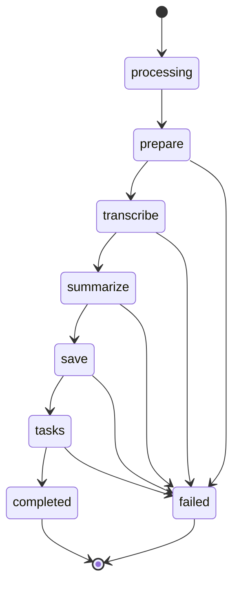
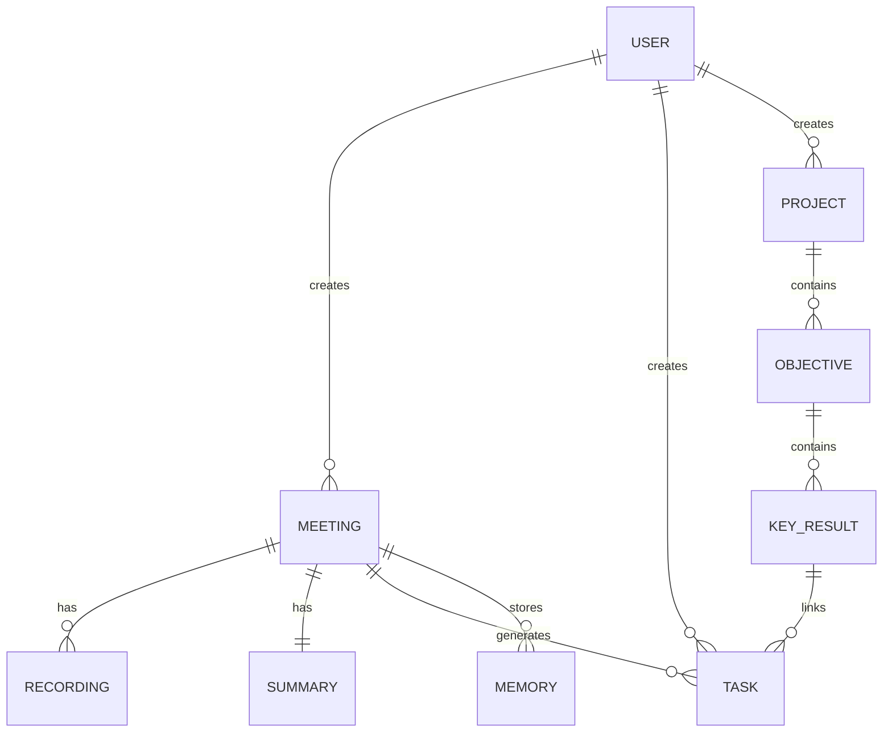

# 缁楊剙宕勬稊婵嗙溇閸忋劌娴楁径褍顒熼悽鐔昏拫娴犺泛鍨遍弬鏉裤亣鐠?
閺傚洦銆傜紓鏍у娇閿涙瓪SWC2026-MEETMIND`

妞ゅ湱娲伴崥宥囆為敍姝歁eetMind`

Project Name: `MeetMind`

妞ゅ湱娲板鈧崣鎴炴瀮濡? 
Version: `1.1`

閸ャ垽妲﹂崥宥囆為敍姝氬鍛八夐崗鍗? 
閺冦儲婀￠敍姝?026-03-24`

All Rights Reserved

---

## 閻╊喖缍?
1. 妞ゅ湱娲板鍌濆牚
2. 瀵偓閸欐垼顓搁崚?3. 閸欘垵顢戦幀褍鍨庨弸?4. 闂団偓濮瑰倸鍨庨弸?5. 濮掑倽顩︾拋鎹愵吀
6. 閺佺増宓佹惔鎾诡啎鐠?7. 閹靛婧€缁旑垯鏅堕柈銊ц鐠佹崘顓?8. 鐠囷妇绮忕拋鎹愵吀

---

## 閺傚洦銆傛穱顔款吂閸樺棗褰?
| 鎼村繐褰?| 娣囶喛顓归崢鐔锋礈 | 閻楀牊婀伴崣?| 娴ｆ粏鈧?| 娣囶喛顓归弮銉︽埂 | 婢跺洦鏁?|
| --- | --- | --- | --- | --- | --- |
| 1 | 閺嶈宓佹い鍦窗瑜版挸澧犳禒锝囩垳閺佸鎮婇崚婵堝瀵偓閸欐垶鏋冨?| 1.0 | Codex | 2026-03-23 | 閸╄桨绨禒鎾崇氨閻滄壆濮哥紓鏍у晸 |
| 2 | 閹稿鐦挧娑櫮侀悧鍫ュ櫢閹烘帞绮ㄩ弸鍕瑢缁旂姾濡?| 1.0 | Codex | 2026-03-23 | 鐎靛綊缍?docx 濡紕澧楅弽鐓庣础 |
| 3 | 閹稿銆嶉惄顔肩杽闂勫懎鐤勯悳鎷屗夐崗鍛箚婢у啨鈧焦鐏﹂弸鍕┾偓浣瑰复閸欙絻鈧焦鏆熼幑顔界ウ娑撳孩鏆熼幑顔肩氨缂佸棜濡?| 1.1 | Codex | 2026-03-24 | 瀵搫瀵查弬鍥х摟閹诲繗鍫妴浣告禈鐞涖劋绗岄幎鈧張顖氬棘閺?|

---

## 1 妞ゅ湱娲板鍌濆牚

### 1.1 妞ゅ湱娲伴懗灞炬珯

閸︺劌娲熼梼鐔峰礂娴ｆ粌婧€閺咁垯鑵戦敍灞肩窗鐠侇喕绱伴幐浣虹敾娴溠呮晸瑜版洟鐓堕妴浣规喅鐟曚降鈧浇顢戦崝銊┿€嶉妴浣规）缁嬪鐣ㄩ幒鎺戞嫲濮瑰洦濮ら弶鎰灐閿涘奔绲炬导鐘电埠濞翠胶鈻煎鈧鈧笟婵婄娴滃搫浼愰弫瀵告倞閿涘苯鐡ㄩ崷銊や簰娑撳妫濋悙鐧哥窗

- 娴兼艾鎮楃痪顏囶洣閺佸鎮婇幈顫礉娣団剝浼呯€硅妲楅柆妤佺础
- 娴兼俺顔呯悰灞藉З妞ゅ綊姣︽禒銉ф纯閹恒儴绻橀崗銉ゆ崲閸旓紕顓搁悶鍡欓兇缂?- 娴兼俺顔呯紒鎾诡啈娑撳酣銆嶉惄顔炬窗閺嶅洢鈧礁鍙ч柨顔剧波閺嬫粏鍔氶懞?- 閸樺棗褰舵导姘愁唴娑擃厾娈戦惌銉ㄧ槕闂呭彞浜掑▽澶嬬┅閸滃苯顦查悽?
`MeetMind` 閻ㄥ嫮娲伴弽鍥ㄦЦ閸掆晝鏁?AI 閼宠棄濮忛敍灞界殺娴兼俺顔呮稉顓犳畱闂堢偟绮ㄩ弸鍕闂婃娊顣舵稉搴㈡瀮閺堫剛娲块幒銉ㄦ祮閸栨牔璐熺紒鎾寸€崠鏍︽崲閸斅扳偓渚€銆嶉惄顔炬窗閺嶅洢鈧焦妫╅崢鍡曠皑娴犺泛鎷扮仦鏇犮仛閺夋劖鏋￠敍灞借埌閹存劏鈧粌鎯?鐠?鐞?閺屻儮鈧繄娈戦崝鐐插彆闂傤厾骞嗛妴?
### 1.2 妞ゅ湱娲扮€规矮缍?
閺堫剟銆嶉惄顔肩暰娴ｅ秳璐熸稉鈧總妤呮桨閸氭垵娲熼梼鐔锋嫲缂佸嫮绮愰惃鍕閼虫垝绱扮拋顔煎礂娴ｆ粌閽╅崣甯礉閹绘劒绶?Web 娑?Mobile 閸欏瞼顏懗钘夊閿涘本鐗宠箛鍐閻愯妲告禒銉ょ窗鐠侇喕璐熸稉顓炵妇閿涘苯鐨㈣ぐ鏇㈢叾閵嗕胶閭憰浣碘偓浣锋崲閸斅扳偓涓盞R閵嗕焦妫╅崢鍡愨偓涓砅T 閸滃瞼鐓＄拠鍡氼唶韫囧棛绮烘稉鈧潻鐐村复閵?
#### 1.2.1 鎼存梻鏁ら崷鐑樻珯

- 閸ャ垽妲﹂崨銊ょ窗閵嗕線銆嶉惄顔荤伐娴兼哎鈧椒楠囬崫浣界槑鐎光€茬窗
- 鐠恒劑鍎撮梻銊︾煛闁矮绱伴妴浣割吂閹磋渹姘﹀ù浣风窗閵嗕浇绻欑粙瀣╃窗鐠?- 闂団偓鐟曚椒绱伴崥搴℃彥闁喎鍨庨崣鎴滄崲閸斅扳偓浣告倱濮濄儲妫╅崢鍡楁嫲閻㈢喐鍨氬Ч鍥ㄥГ閺夋劖鏋￠惃鍕簚閺?
#### 1.2.2 閻╊喗鐖ｆ禍铏瑰參

- 妞ゅ湱娲扮紒蹇曟倞
- 娴溠冩惂缂佸繒鎮?- 閻柨褰傞崶銏ゆЕ
- 娴间椒绗熼崡蹇庣稊閸ャ垽妲?- 闂団偓鐟曚浇绻樼悰灞肩窗鐠侇喚閭憰浣碘偓浣锋崲閸旓紕顓搁悶鍡楁嫲閻儴鐦戝▽澶嬬┅閻ㄥ嫬顒熼悽鐔锋礋闂冪喐鍨ㄩ崚娑楃瑹閸ャ垽妲?
### 1.3 妞ゅ湱娲伴弬瑙勵攳

閺堫剟銆嶉惄顕€鍣伴悽?`pnpm Monorepo + FastAPI` 閻ㄥ嫯娉曠粩顖氬礂閸氬本鏌熷鍫礉娴犮儮鈧粈绱扮拋顔光偓婵呰礋娑撶粯鏆熼幑顔肩杽娴ｆ搫绱濈亸鍡楃秿闂婄偨鈧胶閭憰浣碘偓浣锋崲閸斅扳偓渚€銆嶉惄顔衡偓浣规）閸樺棎鈧赋PT 閸滃苯濮幍瀣厴閸旀稐瑕嗛懕鏂捐礋缂佺喍绔撮惃鍕殶閹诡噣妫撮悳顖樷偓鍌滈兇缂佺喍绗夐弰顖滅暆閸楁洖婀撮幎濠傤樋娑擃亜濮涢懗浠嬨€夐棃銏犵垻閸欑姴婀稉鈧挧鍑ょ礉閼板本妲搁崶瀵哥搏閸氬奔绔存稉顏冪窗鐠?ID 瀵よ櫣鐝涢崗銊╂懠鐠侯垰鍙ч懕鏃撶窗娴兼俺顔呴崚娑樼紦閸氬骸褰叉禒銉х拨鐎规艾缍嶉棅绛圭礉瑜版洟鐓堕崚鍡樼€介崥搴濋獓閸戠儤鎲崇憰浣告嫲鐞涘苯濮╂い鐧哥礉鐞涘苯濮╂い纭呯箻娑撯偓濮濄儴娴嗛崠鏍﹁礋娴犺濮熼敍灞炬喅鐟曚礁寮甸崣顖欎簰閻㈢喐鍨氭い鍦窗 / OKR閵嗕焦妫╅崢鍡曠皑娴犺泛鎷板Ч鍥ㄥГ閺夋劖鏋￠敍灞炬付缂佸牅绶?Web閵嗕府obile 閸滃本娅ら懗钘夊И閹靛绮烘稉鈧☉鍫ｅ瀭閵?
閸︺劋鍞惍浣虹矋缂佸洣绗傞敍宀勩€嶉惄顔煎瀻娑?`packages/web`閵嗕梗packages/mobile`閵嗕梗packages/shared`閵嗕梗packages/api` 閸ユ稐閲滈弽绋跨妇閸栧懌鈧倽绻栭弽椋庢畱閹峰棗鍨庨弬鐟扮础閸忓ジ銆愭禍鍡忊偓婊嗘硶缁旑垰顦查悽銊⑩偓婵嗘嫲閳ユ粎顏笟褍妯婂鍌椻偓婵呰⒈缁娓跺Ч鍌︾窗閸忓彉闊╃仦鍌濈鐠愶絿绮烘稉鈧猾璇茬€烽妴浣瑰复閸欙絽浼愰崢鍌氭嫲閸╄櫣顢呮總鎴犲閿涘eb 娑?Mobile 閸︺劏銆冮悳鏉跨湴閸滃矂澹岄弶鍐ㄧ摠閸屻劋绗傛穱婵囧瘮閸氬嫯鍤滅€圭偟骞囬敍灞芥倵缁旑垰鍨梿鍡曡厬婢跺嫮鎮婇弶鍐閵嗕焦鏆熼幑顔肩摠閸屻劊鈧竸I 缂傛牗甯撻妴浣割嚤閸戠儤绁︾粙瀣嫲閻樿埖鈧胶顓搁悶鍡愨偓鍌濈箹缁夊秵鐏﹂弸鍕缉閸忓秳绨￠崣宀€顏€涙顔屾稉宥勭閼锋番鈧焦甯撮崣锝夊櫢婢跺秴鐣炬稊澶婃嫲娑撴艾濮熼柅鏄忕帆閸掑棗寮堕惃鍕６妫版ǜ鈧?
娴犲酣鍎寸純鎻掓嫲鏉╂劘顢戦張鍝勫煑閻绱濋張顒勩€嶉惄顕€鍣伴悽銊⑩偓婊勬箛閸旓紕顏稉顓炵妇閸?+ 鐎广垺鍩涚粩顖濅氦閻樿埖鈧讲鈧繄娈戠拋鎹愵吀閵嗗倷绱扮拋顔衡偓浣锋崲閸斅扳偓渚€銆嶉惄顔衡偓浣洪偗鐟曚礁鎷扮€电厧鍤紒鎾寸亯閸у洣浜?FastAPI 閸氬海顏稉鍝勬暜娑撯偓閸欘垯淇婇弫鐗堝祦濠ф劧绱漇QLite 鐠愮喕鐭楃紒鎾寸€崠鏍ㄦ殶閹诡喛鎯ゆ惔鎿勭礉閺堫剙婀撮弬鍥︽缁崵绮?`uploads/` 鐠愮喕鐭楁穱婵嗙摠瑜版洟鐓堕崪灞筋嚤閸戦缚绁禍褝绱滱I 閺堝秴濮熺拹鐔荤煑鐎靛綊鐓舵０鎴濇嫲閺傚洦婀版潻娑滎攽妤傛ü鐜崐鑹邦嚔娑斿濮炲銉ｂ偓淇塭b 娑?Mobile 闁垝绗夐惄瀛樺复閹镐椒绠欓崠鏍ㄧ壋韫囧啩绗熼崝鈩冩殶閹诡噯绱濋懓灞炬Ц闁俺绻?API 閼惧嘲褰囬張鈧弬鎵Ц閹緤绱濋崶鐘愁劃閸欘垯浜掓径鈺冨姧娣囨繃瀵旂捄銊ь伂娑撯偓閼峰瓨鈧嶇礉娑旂喍绌舵禍搴℃倵缂侇厽娴涢幑銏℃殶閹诡喖绨遍妴浣割杻閸旂姴顕挒鈥崇摠閸屻劍鍨ㄥ鏇炲弳濞戝牊浼呴梼鐔峰灙閵?
鐎甸€涚艾闂€鑳偓妤佹娑撴艾濮熼敍灞炬拱妞ゅ湱娲伴柌鍥╂暏瀵倹顒炴禒璇插閼板矂娼崥灞绢劄闂冭顢ｉ幒銉ュ經閵嗗倷浜掓导姘愁唴閸掑棙鐎介崪?PPT 鐎电厧鍤稉杞扮伐閿涘苯澧犵粩顖氬涧鐠愮喕鐭楅崣鎴ｆ崳娴犺濮熼獮鎯扮枂鐠囥垻濮搁幀渚婄礉閸氬海顏崷銊ユ倵閸欐澘鐣幋鎰祮閸愭瑣鈧焦鎲崇憰浣烘晸閹存劑鈧礁顕遍崶鎯у晸閸忋儯鈧椒鎹㈤崝鈥冲灡瀵ゅ搫鎷伴弬鍥︽鐎电厧鍤妴鍌濈箹缁夊秵鏌熷鍫熸纯缁楋箑鎮庨惇鐔风杽閸楀繋缍旈崷鐑樻珯娑擃厾娈戦弮璺烘閻楃懓绶涢敍灞肩瘍閼宠棄婀В鏃囩濠曟梻銇氶弮鑸电閺呮澘鐫嶇粈铏归兇缂佺喓娈戝銉р柤閸栨牞顔曠拋陇鍏橀崝娑栤偓?
### 1.4 妞ゅ湱娲伴惄顔界垼

- 瀵よ櫣鐝涙导姘愁唴閵嗕礁缍嶉棅鐐解偓浣洪偗鐟曚降鈧椒鎹㈤崝掳鈧線銆嶉惄顔衡偓浣规）閸樺棛娈戞稉鈧担鎾冲閺佺増宓侀柧鎹愮熅
- 閺€顖涘瘮 Web 娑?Mobile 閸欏瞼顏紒鐔剁鐠佸潡妫堕崪宀€绮烘稉鈧弫鐗堝祦濡€崇€?- 閼奉亜濮╅悽鐔稿灇娴兼俺顔呯痪顏囶洣閵嗕浇顢戦崝銊┿€嶉妴浣光偓婵堟樊鐎电厧娴橀崪宀勩€嶉惄?OKR
- 闁俺绻冮弲楦垮厴閸斺晜澧滄潻娑楃濮濄儵妾锋担搴☆槻閺夊倹鎼锋担婊堟，濡?- 閻㈢喐鍨氶崣顖滄纯閹恒儰绗呮潪鑺ュ灗鐏炴洜銇氶惃鍕嚤閸戠儤鍨氶弸婊愮礉婵?ICS閵嗕赋DF閵嗕赋PTX

### 1.5 妞ゅ湱娲版禒宄扳偓?
- 闂勫秳缍嗘导姘愁唴閸氬骸顦╅悶鍡樺灇閺?- 閹绘劕宕屾禒璇插閽€钘夋勾娑撳氦鐭楁禒鏄忔嫹闊亝鏅ラ悳?- 鐏忓棔绱扮拋顔剧波閺嬫粎娲块幒銉ф捈閸忋儵銆嶉惄顔绢吀閻炲棗鎷伴弮鍫曟？缁狅紕鎮婄化鑽ょ埠
- 閺€顖涘瘮閻儴鐦戝▽澶嬬┅閸滃矁娉曟导姘愁唴婢跺秶鏁?- 娑撻缚顕崇粙瀣潔缁€鎭掆偓浣虹彽鐠ф稓鐡熸潏鈺佹嫲閸氬海鐢绘禍褍鎼ч崠鏍嚡娴狅絾褰佹笟娑樼暚閺佸閮寸紒鐔风唨绾偓

---

## 2 瀵偓閸欐垼顓搁崚?
### 2.1 閺堚偓缂佸牆鎲熼悳鏉胯埌瀵?
閺堫剟銆嶉惄顔芥付缂佸牅浜掗垾婊嗘硶缁旑垱娅ら懗鎴掔窗鐠侇喖宕楁担婊呴兇缂佺啿鈧繂鑸板蹇撴啛閻滃府绱濋崠鍛閿?
- Web 鎼存梻鏁ら敍姘攽闂堛垺绁荤憴鍫濇珤鐠佸潡妫堕惃鍕瘜瀹搞儰缍旈崣?- Mobile 鎼存梻鏁ら敍姘唨娴?Expo 閻ㄥ嫮些閸斻劎顏惔鏃傛暏
- 閸氬海顏張宥呭閿涙碍褰佹笟?REST API閵嗕竸I 閸掑棙鐎介妴浣锋崲閸旓紕鏁撻幋鎰嫲鐎电厧鍤懗钘夊
- 瀵偓閸欐垶鏋冨锝忕窗鐠囧瓨妲戠化鑽ょ埠缂佹挻鐎妴浣哄箚婢у啨鈧線娓跺Ч鍌樷偓浣筋啎鐠佲€茬瑢鐎圭偟骞?
### 2.2 娑撴槒顩﹂崝鐔诲厴閹诲繗鍫?
| 閸旂喕鍏樺Ο鈥虫健 | 閸旂喕鍏橀幓蹇氬牚 |
| --- | --- |
| 娴兼俺顔呯粻锛勬倞 | 閸掓稑缂撻妴浣虹椽鏉堟垯鈧焦鐓＄拠顫偓浣稿灩闂勩倓绱扮拋?|
| 瑜版洟鐓剁€电厧鍙?| 娑撳﹣绱惰ぐ鏇㈢叾娴ｆ粈璐熸导姘愁唴閸掑棙鐎芥潏鎾冲弳 |
| AI 缁绢亣顩﹂崚鍡樼€?| 閼奉亜濮╅悽鐔稿灇閹芥顩﹂妴浣稿枀缁涙牓鈧線顥撻梽鈹库偓浣筋攽閸斻劑銆嶉崪宀冩祮閸愭瑦鏋冮張?|
| 閹繄娣€电厧娴?| 閸╄桨绨导姘愁唴缁绢亣顩﹂悽鐔稿灇缂佹挻鐎崠鏍ь嚤閸ユ儳鑻熼弨顖涘瘮缂傛牞绶?|
| 娴犺濮熼惇瀣緲 | 鐎电顢戦崝銊┿€嶆潻娑滎攽娴犺濮熼崠鏍吀閻炲棔绗岄悩鑸碘偓浣圭ウ鏉?|
| 妞ゅ湱娲?/ OKR | 娴犲簼绱扮拋顔鹃偗鐟曚胶鏁撻幋鎰般€嶉惄顔衡偓浣烘窗閺嶅洤鎷伴崗鎶芥暛缂佹挻鐏?|
| 閺冦儱宸婚懕鏂垮З | 閼辨艾鎮庢导姘愁唴閸滃奔鎹㈤崝鈥宠埌閹存劗绮烘稉鈧弮銉р柤鐟欏棗娴?|
| 閺呴缚鍏橀崝鈺傚 | 娴犮儴鍤滈悞鎯邦嚔鐟封偓鐠嬪啰鏁ゆ导姘愁唴閵嗕椒鎹㈤崝掳鈧線銆嶉惄顔衡偓浣虹倳鐠囨垹鐡戦懗钘夊 |
| PPT 閻㈢喐鍨?| 閸╄桨绨导姘愁唴缁绢亣顩﹂悽鐔稿灇濠曟梻銇氶弬鍥╊焾楠炶泛顕遍崙?PDF / PPTX |
| 娴兼俺顔呯拋鏉跨箓 | 娑撹桨绱扮拋顔肩紦缁斿鐓＄拠鍡樻蒋閻╊喖鑻熼弨顖涘瘮閸氬海鐢诲Λ鈧槐?|

### 2.3 鏉╂劘顢戦悳顖氼暔

閺堫剟銆嶉惄顕€鍣伴悽銊х埠娑撯偓娴犳挸绨遍妴浣稿蓟缁旑垰澧犵粩顖樷偓浣稿礋閸氬海顏張宥呭閻ㄥ嫬绱戦崣鎴炴煙瀵骏绱濋崶鐘愁劃鏉╂劘顢戦悳顖氼暔娑撳秳绮庣憰浣筋洬閻?Web 妞ょ敻娼伴敍宀冪箷鐟曚浇顩惄?Mobile 鐠嬪啳鐦妴涓処 閺堝秴濮熺拫鍐暏閸滃苯顕遍崙杞扮贩鐠ф牓鈧倸绱戦崣鎴炴閹恒劏宕樻担璺ㄦ暏娑撯偓閸欑増鈧嗗厴鏉堝啫銈介惃鍕拱閸︽澘绱戦崣鎴炴簚閿涘苯鎮撻弮鎯扮箥鐞?Next.js閵嗕笚astAPI閵嗕笒xpo閵嗕讣QLite 閸?Slidev 鐎电厧鍤ù浣衡柤閵嗗倸缍嬮崜宥勭波鎼存挷鑵戦惃鍕箚婢у啴鍘ょ純顔煎嚒缂佸繋缍嬮悳棰佺啊鏉╂瑤绔撮悙鐧哥窗Web 鐠?Next.js App Router閿涘obile 鐠?Expo Router閿涘苯鎮楃粩顖欎簰 FastAPI 鐎电懓顦婚幓鎰返 REST API閿涘奔绗侀懓鍛粹偓姘崇箖閸忓彉闊╃猾璇茬€风仦鍌欑箽閹镐礁顨栫痪锔跨閼锋番鈧?
#### 2.3.1 閺傛澘绨查悽銊х波閺嬪嫬寮峰鈧崣鎴犲箚婢у啳顔曠拋?
瑜版挸澧犳い鍦窗闁插洨鏁?Monorepo 缂佹挻鐎敍灞惧Ω鐠恒劎顏崗顒€鍙￠柅鏄忕帆閸滃瞼顏笟褍妯婂鍌炩偓鏄忕帆閸嬫矮绨″〒鍛珰閹峰棗鍨庨妴淇檖ackages/shared` 娴ｆ粈璐熺紒鐔剁婵傛垹瀹崇仦鍌︾礉鐠愮喕鐭楃紒瀛樺Б缁鐎风€规矮绠熼崪灞介挬閸欑増妫ら崗宕囨畱 API Client閿涙矖packages/web` 鐠愮喕鐭?PC 瀹搞儰缍旈崣鎵櫕闂堫澀绗?SSR 閸︾儤娅欐稉瀣畱鐠囬攱鐪版潪顒€褰傞敍娌梡ackages/mobile` 鐠愮喕鐭楃粔璇插З缁旑垶銆夐棃顫偓涓糴cureStore 闁村瓨娼堥崪?Expo 鏉╂劘顢戦弮鍫曗偓鍌炲帳閿涙矖packages/api` 鐠愮喕鐭楁导姘愁唴閵嗕椒鎹㈤崝掳鈧線銆嶉惄顔衡偓浣规）閸樺棎鈧礁濮幍瀣ㄢ偓浣割嚤閸戣桨绗?AI 缂傛牗甯撻妴鍌濈箹閺嶉娈戠紒鎾寸€張澶夌瑏娑擃亞娲块幒銉ャ偨婢跺嫸绱扮粭顑跨閿涘瞼琚崹瀣嫲閹恒儱褰涙稉宥勭窗閸?Web 娑?Mobile 闂傛挳鍣告径宥囨樊閹躲倧绱辩粭顑跨癌閿涘苯鎮楃粩顖欑瑹閸旓繝鈧槒绶梿鍡曡厬閿涘矁娉曠粩顖氬涧閸嬫艾鐫嶇粈鍝勬嫲娴溿倓绨伴敍娑氼儑娑撳绱濆В鏃囩濠曟梻銇氶弮鑸垫＆閼虫垝缍嬮悳鏉夸紣缁嬪鍨庣仦鍌︾礉娑旂喍绌舵禍搴℃倵缂侇厽澧跨仦鏇燁攽闂堛垻顏妴浣哥毈缁嬪绨粩顖涘灗閸︺劎鍤庨柈銊ц閵?
瀵偓閸欐垹骞嗘晶鍐啎鐠佲€茬瑐閿涘本甯归懡鎰簰閺堫剙婀存稉鈧担鎾冲閼辨棁鐨熸稉杞板瘜閵嗗倹鐗撮惄顔肩秿闁俺绻?`pnpm` 缂佺喍绔寸€瑰顥婃笟婵婄閿涘eb 鏉╂劘顢戦崷?Next.js 瀵偓閸欐垶婀囬崝鈥虫珤閿涘瓑PI 鏉╂劘顢戦崷?FastAPI + Uvicorn閿涘obile 闁俺绻?Expo 閸氼垰濮╃拫鍐槸閵嗕繅eb 姒涙顓婚柅姘崇箖 `INTERNAL_API_URL` 閸?Next.js 闁插秴鍟撴禒锝囨倞鐠佸潡妫堕崥搴ｎ伂閿涙背obile 闁俺绻?`EXPO_PUBLIC_API_URL` 閻╁瓨甯寸拋鍧楁６閸氬海顏敍娑樻倵缁旑垱婀伴崷棰佸▏閻?SQLite + WAL 濡€崇础閿涘苯鍘ら崢濠氼杺婢舵牗鏆熼幑顔肩氨闁劎璁查幋鎰拱閵嗗倸顕禍?AI 閻╃鍙ч懗钘夊閿涘苯褰ч棁鈧柊宥囩枂 `AI_PROVIDER` 娑撳骸顕惔鏃傛畱 API Key 閸楀啿褰茬€瑰本鍨氭潪顒€鍟撻妴浣规喅鐟曚降鈧胶鐐曠拠鎴濇嫲 OKR 閻㈢喐鍨氶柧鎹愮熅閵?
#### 2.3.2 鏉烆垯娆㈤悳顖氼暔

| 鏉烆垯娆?/ 濡楀棙鐏?| 閻楀牊婀?| 閺夈儲绨?| 鐠囧瓨妲?|
| --- | --- | --- | --- |
| macOS | `26.3.1 (a)` | 閺堫剚婧€ `sw_vers` | 瑜版挸澧犲鈧崣鎴炴簚閹垮秳缍旂化鑽ょ埠 |
| Node.js | `25.4.0` | 閺堫剚婧€ `node -v` | Web 娑?Mobile 閺嬪嫬缂撴潻鎰攽閺?|
| pnpm | `10.28.1` | 閺堫剚婧€ `pnpm -v` | Monorepo 娓氭繆绂嗙粻锛勬倞 |
| Python | `3.11.14` | 閺堫剚婧€ `python3 --version` | FastAPI 閸氬海顏潻鎰攽閺?|
| Next.js | `16.1.4` | `packages/web/package.json` | Web 閸撳秶顏鍡樼仸 |
| React閿涘湹eb閿?| `19.2.3` | `packages/web/package.json` | Web 缂佸嫪娆㈡潻鎰攽閺?|
| React DOM | `19.2.3` | `packages/web/package.json` | 濞村繗顫嶉崳銊﹁閺屾挸鐪?|
| Expo | `52.0.46` | `packages/mobile/package.json` | 缁夎濮╃粩顖氱磻閸欐垼绻嶇悰灞绢攱閺?|
| Expo Router | `4.0.20` | `packages/mobile/package.json` | 缁夎濮╃粩顖涙瀮娴犳儼鐭鹃悽?|
| React閿涘湣obile閿?| `18.3.1` | `packages/mobile/package.json` | Expo SDK 52 鐎电懓绨查悧鍫熸拱 |
| React Native | `0.76.9` | `packages/mobile/package.json` | 缁夎濮╃粩顖氬斧閻㈢喕绻嶇悰灞炬 |
| FastAPI | `0.109.0` | `packages/api/requirements.txt` | 閸氬海顏?REST API 濡楀棙鐏?|
| SQLAlchemy | `2.0.23` | `packages/api/requirements.txt` | 瀵倹顒?ORM 娑撳孩鏆熼幑顔款問闂傤喖鐪?|
| Pydantic | `2.5.0` | `packages/api/requirements.txt` | 鐠囬攱鐪?/ 閸濆秴绨插Ο鈥崇€烽弽锟犵崣 |
| SQLite | 缁崵绮洪崘鍛枂 | 妞ゅ湱娲版妯款吇閺傝顢?| 瀵偓閸欐垳绗屽鏃傘仛閻滎垰顣ㄩ弫鐗堝祦鎼?|
| Slidev CLI | `52.11.3` | `packages/web/package.json` | 濠曟梻銇氶弬鍥╊焾閻㈢喐鍨?|
| Playwright Chromium | `1.58.0` | `packages/web/package.json` | PPT / PDF 鐎电厧鍤〒鍙夌厠 |
| Zustand | `5.0.10` | Web / Mobile `package.json` | 鏉炲鍣洪悩鑸碘偓浣侯吀閻?|

鐠囧瓨妲戦敍姝恊b 缁旑垯濞囬悽?React 19閿涘obile 缁旑垯绮涙担璺ㄦ暏 React 18.3.1閿涘矁绻栭獮鍫曟姜娑撳秳绔撮懛纾嬵啎鐠佲槄绱濋懓灞炬Ц閻㈠彉绨?Expo SDK 52 娑?React Native 閻楀牊婀伴惌鈺呮█閻ㄥ嫬鍚嬬€硅鈧呭閺夌喆鈧倹鏋冨锝勮厬闂団偓閺勫海鈥橀崠鍝勫瀻 Web React 閻楀牊婀版稉?Mobile React 閻楀牊婀伴敍宀勪缉閸忓秷鐦庣€孤ゎ嚖閸掋們鈧?
#### 2.3.3 绾兛娆㈤悳顖氼暔

| 绾兛娆㈡い鍦窗 | 鐎圭偤妾柊宥囩枂 / 閻滎垰顣?| 閻劑鈧棁顕╅弰?|
| --- | --- | --- |
| 瀵偓閸欐垳瀵岄張?| `MacBook Pro (MacBookPro18,2)` | 娑撴槒顩﹀鈧崣鎴欌偓浣界殶鐠囨洑绗屽鏃傘仛鐠佹儳顦?|
| CPU | `Apple M1 Max`閿?0 閺嶉潻绱? 閹嗗厴閺?+ 2 閼宠姤鏅ラ弽闈╃礆 | 閺€顖涙嫼閺堫剙婀存径姘崇箻缁嬪浠堢拫鍐х瑢鐎电厧鍤禒璇插 |
| GPU | `Apple M1 Max` 32 閺?GPU | 閻劋绨崜宥囶伂濞撳弶鐓嬫稉搴☆嚤閸戝搫濮為柅?|
| 閸愬懎鐡?| `32 GB` | 閺€顖涙嫼 Next.js閵嗕笚astAPI閵嗕笒xpo閵嗕焦绁荤憴鍫濇珤娑撳孩膩閹风喎娅掗崥灞炬鏉╂劘顢?|
| 閺勫墽銇氶崳?| 閸愬懐鐤?Liquid Retina XDR閿涘畭3456 x 2234` | 娓氬じ绨?Web 妞ょ敻娼版稉搴☆樋缁愭褰涚拫鍐槸 |
| 缁夎濮╃粩顖濈殶鐠囨洜骞嗘晶?| `Android Emulator @ Medium_Phone_API_36.1` / iOS Simulator / Expo Go | 缁夎濮╃粩顖濅粓鐠嬪啨鈧礁缍嶉棅鍐差嚤閸忋儯鈧線銆夐棃銏ょ崣鐠?|

#### 2.3.4 AI 濡€崇€锋稉搴㈠絹娓氭稓娈戦張宥呭

| AI 閺堝秴濮?| 濡€崇€?| 閻劑鈧?| 婢跺洦鏁?|
| --- | --- | --- | --- |
| Tongyi Qwen閿涘牓绮拋銈忕礆 | `qwen-3-flash-preview` | 闂婃娊顣舵潪顒€鍟撻妴浣风窗鐠侇喗鎲崇憰浣碘偓涓盞R 閻㈢喐鍨氶妴浣虹倳鐠囨垯鈧礁濮幍瀣嚠鐠?| 閻?`AI_PROVIDER=qwen` 閸氼垳鏁?|
| Tongyi Qwen 閸ユ儳鍎氶懗钘夊 | `qwen-3-pro-image-preview` | 閸ユ儳鍎氶惄绋垮彠閻㈢喐鍨氶懗钘夊妫板嫮鏆€ | 瑜版挸澧犳稉鏄忣洣閻劋绨崶鎯у剼閸︾儤娅欓幍鈺佺潔 |
| Tongyi Qwen閿涘牆褰查柅澶涚礆 | `whisper-1` | 闂婃娊顣舵潪顒€鍟?| 閻?`AI_PROVIDER=qwen` 閸氼垳鏁?|
| Tongyi Qwen閿涘牆褰查柅澶涚礆 | `gpt-5.2` | 閹芥顩﹂妴浣割嚤閸ヤ勘鈧胶鐐曠拠鎴欌偓涓盞R 閻㈢喐鍨?| 閻劋绨紒鎾寸€崠鏍波閺嬫粎鏁撻幋?|
| Tongyi Qwen閿涘牆褰查柅澶涚礆 | `gpt-4o-mini` | 閸斺晜澧滈柅姘辨暏閼卞﹤銇?| 閻劋绨潏鍐氦闁插繐顕拠婵嗘簚閺?|

瑜版挸澧犳い鍦窗姒涙顓婚幓鎰返 Tongyi Qwen 鐠侯垰绶為敍灞藉斧閸ョ姵妲搁崗璺烘躬閳ユ粌宕熷Ο鈥崇€锋径鍕倞鏉烆剙鍟?+ 閹芥顩?+ 缂佹挻鐎崠鏍翻閸戣　鈧繃鏌熼棃銏犵杽閻滄壆鐣濋崡鏇樷偓浣瑰复閸忋儲鍨氶張顑跨秵閿涙稑鎮撻弮鏈电箽閻?Tongyi Qwen 鐠侯垰绶為敍灞肩┒娴滃骸婀稉宥呮倱濠曟梻銇氶悳顖氼暔娑擃厼鍨忛幑銏℃箛閸斺€虫櫌閿涘苯顤冨铏归兇缂佺喓娈戦崣顖涙禌閹广垺鈧冩嫲妞翠焦顥楅幀褋鈧?
閸忔娊鏁悳顖氼暔閸欐﹢鍣洪敍?
```env
INTERNAL_API_URL=http://localhost:3452/api
INTERNAL_API_URL_UPLOADS=http://localhost:3452/uploads
NEXT_PUBLIC_PROD_API_PATH=/api
EXPO_PUBLIC_API_URL=http://localhost:3452/api
DASHSCOPE_API_KEY=
DASHSCOPE_API_KEY=
DATABASE_URL=
```

### 2.4 妤犲本鏁归弽鍥у櫙

- 閸欘垱顒滅敮绋挎儙閸?Web閵嗕竸PI閵嗕府obile 瀵偓閸欐垹骞嗘晶?- 閸欘垰鐣幋鎰窗鐠侇喖鍨卞杞扮瑢瑜版洟鐓剁€电厧鍙?- 閸欘垵袝閸?AI 閸掑棙鐎介獮鑸电叀閻閭憰浣碘偓浣锋崲閸斺€虫嫲閹繄娣€电厧娴?- 閸欘垰婀禒璇插閻婢橀弻銉ф箙閸滃本娲块弬棰佹崲閸旓紕濮搁幀?- 閸欘垱鐗撮幑顔荤窗鐠侇喚鏁撻幋鎰般€嶉惄?/ OKR
- 閸欘垰婀弮銉ュ坊妞ゅ灚鐓￠惇瀣╃窗鐠侇喕绗屾禒璇插閺冨爼妫块弫鐗堝祦
- 閸欘垶鈧俺绻冮弲楦垮厴閸斺晜澧滄潻娑滎攽閼峰啿鐨稉鈧猾璇蹭紣閸忕柉鐨熼悽?- 閸欘垳鏁撻幋鎰嫙娑撳娴?PPT 閹?PDF
- 閺傚洦銆傞崘鍛啇娑撳骸鐤勯梽鍛淬€嶉惄顔剧波閺嬪嫪绔撮懛?
### 2.5 閸忔娊鏁梻顕€顣?
- AI 閹恒儱褰涢棁鈧憰浣规箒閺佸牆鐦戦柦銉礉閸氾箑鍨崚鍡樼€介惄绋垮彠閼宠棄濮忔稉宥呭讲閻?- 闂€鍧楃叾妫版垵鍨庨弸鎰瑢 PPT 鐎电厧鍤懓妤佹鏉堝啴鏆遍敍宀勬付鐟曚礁澧犵粩顖氱潔缁€楦跨箻鎼?- 缁夎濮╃粩顖氭躬閻喐婧€鐠嬪啳鐦弮鍫曟付鐟曚焦顒滅涵顕€鍘ょ純?API 閸︽澘娼?- SQLite 闁倸鎮庡鈧崣鎴滅瑢濠曟梻銇氶敍宀冨婢堆嗩潐濡€宠嫙閸欐垿娓堕崡鍥╅獓閺佺増宓佹惔鎾存煙濡?
### 2.6 鏉╂稑瀹崇€瑰甯?
| 闂冭埖顔?| 娑撴槒顩﹂崘鍛啇 |
| --- | --- |
| 缁?1 闂冭埖顔?| 閹碱厼缂?Monorepo閵嗕箘eb閵嗕竸PI閵嗕讣hared 閸╄櫣顢呭鍡樼仸 |
| 缁?2 闂冭埖顔?| 鐎瑰本鍨氭导姘愁唴缁狅紕鎮婇妴浣哥秿闂婂啿顕遍崗銉ｂ偓涓処 缁绢亣顩﹂悽鐔稿灇 |
| 缁?3 闂冭埖顔?| 鐎瑰本鍨氭禒璇插閻婢橀妴渚€銆嶉惄?/ OKR閵嗕焦妫╅崢鍡氫粓閸?|
| 缁?4 闂冭埖顔?| 鐎瑰本鍨氶弲楦垮厴閸斺晜澧滈妴涓砅T 閻㈢喐鍨氶妴浣风窗鐠侇喛顔囪箛?|
| 缁?5 闂冭埖顔?| 鐎瑰本鍨氱粔璇插З缁旑垶鈧倿鍘ら妴浣规瀮濡楋絾鏆ｉ悶鍡曠瑢鐏炴洜銇氭导妯哄 |

### 2.7 瀵偓閸欐垿顣╃粻?
閺堫剟銆嶉惄顔讳簰鐠囧墽鈻煎鈧崣鎴濇嫲缁旂偠绂岀仦鏇犮仛娑撹櫣娲伴弽鍥风礉妫板嫮鐣绘禒銉ㄨ拫娴犳湹绗屾禍鎴炴箛閸斺剝绉烽懓妞捐礋娑撲紮绱?
- 閺堫剙婀村鈧崣鎴濅紣閸忓嚖绱板鈧┃鎰礋娑撲紮绱濋幋鎰拱娴?- AI 閺堝秴濮熺拫鍐暏閿涙碍瀵滈幒銉ュ經鐠嬪啰鏁ゅ▎鈩冩殶鐠伮ゅ瀭
- 閸╃喎鎮?/ 闁劎璁查敍姘川缁€娲▉濞堥潧褰叉稉宥呮儙閻劍顒滃蹇曞殠娑撳﹥婀囬崝?- 鐠佹儳顦幋鎰拱閿涙矮濞囬悽銊у箛閺堝绱戦崣鎴犳暩閼存垳绗岄幍瀣簚閸楀啿褰?
---

## 3 閸欘垵顢戦幀褍鍨庨弸?
### 3.1 閹垛偓閺堫垰褰茬悰灞锯偓褍鍨庨弸?
閺堫剟銆嶉惄顔炬畱閹垛偓閺堫垵鐭剧痪鍨徔婢跺洩绶濇妯哄讲鐞涘本鈧嶇礉閸樼喎娲滈崷銊ょ艾閹碘偓闁濡ч張顖氭綆閺夈儴鍤滈幋鎰暃閻㈢喐鈧緤绱濇稉鏂剧瑢閳ユ粌顦跨粩顖氬礂閸?+ AI 缂傛牗甯?+ 韫囶偊鈧喐绱ㄧ粈琛♀偓婵堟畱閻╊喗鐖ｆ妯哄閸栧綊鍘ら妴淇塭b 缁旑垶鍣伴悽?`Next.js 16 + React 19`閿涘苯褰叉禒銉ユ倱閺冭埖寮х搾瀹犵熅閻㈣京绮嶇紒鍥モ偓涓糞R/CSR 濞ｅ嘲鎮庡〒鍙夌厠閵嗕椒鍞悶鍡氭祮閸欐垵鎷版径宥嗘絽瀹搞儰缍旈崣鎵櫕闂堛垺鐎铏圭搼闂団偓濮瑰偊绱盡obile 缁旑垶鍣伴悽?`Expo 52 + React Native 0.76`閿涘苯婀稉宥嗘▔閽佹顤冮崝鐘插斧閻㈢喖妫Σ娑氭畱閸撳秵褰佹稉瀣暚閹存劗些閸斻劎顏い鐢告桨娑撳骸缍嶉棅鍐差嚤閸忋儴鍏橀崝娑崇幢閸氬海顏柌鍥╂暏 `FastAPI + SQLAlchemy async`閿涘苯鍙挎径鍥婵傜晫娈戠猾璇茬€烽幓鎰仛閵嗕礁绱撳?I/O 閺€顖涘瘮娑撳孩甯撮崣锝呯紦濡ゅ厴閸旀冻绱濋柅鍌氭値閹佃儻娴囬弬鍥︽娑撳﹣绱堕妴浣稿瀻閺嬫劒鎹㈤崝鈥虫嫲婢舵碍膩閸?API閵?
娴犲氦娉曠粩顖氬礂閸氬矁顫楁惔锔炬箙閿涘畭packages/shared` 鐏忓棛琚崹瀣暰娑斿鎷?API 瀹搞儱宸剁紒鐔剁閺€璺哄經閿涘矁鍏橀張澶嬫櫏闁灝鍘ら垾娣瞖b 娑撯偓婵傛琚崹瀣ㄢ偓涓畂bile 娑撯偓婵傛琚崹瀣ㄢ偓浣告倵缁旑垱甯撮崣锝呭晙娑撯偓婵傛鎮婄憴锝傗偓婵堟畱鐢瓕顫嗛梻顕€顣介敍娑楃矤 AI 闂嗗棙鍨氱憴鎺戝閻绱濇い鍦窗瀹歌尙绮￠崗宄邦槵 Tongyi Qwen 娑?Tongyi Qwen 閸欏矂鈧岸浜剧€圭偟骞囬敍灞藉讲娴犮儲鐗撮幑顔界川缁€铏瑰箚婢у啯鍨?Key 閸欘垳鏁ら幀褍鍨忛幑銏∧侀崹瀣剁幢娴犲骸顕遍崙鍝勭潔缁€楦款潡鎼达妇婀呴敍瀹峉lidev + Playwright` 閼宠姤濡哥紒鎾寸€崠鏍偗鐟曚浇绻樻稉鈧銉ㄦ祮閸栨牔璐熼崣顖濐潒閸?PPT/PDF 閹存劖鐏夐敍宀冪箹鐎甸€涚艾缁旂偠绂岀仦鏇犮仛鐏忋倕鍙鹃柌宥堫洣閵嗗倸娲滃銈忕礉閺堫剟銆嶉惄顔艰嫙闂堢偞顩ц箛鍨鐟佸拑绱濋懓灞炬Ц閸︺劌浼愮粙瀣杽閻滄澘鐪伴棃銏犲徔婢跺洤鐣弫纾嬫儰閸︽媽鐭惧鍕┾偓?
### 3.2 鐠у嫭绨崣顖濐攽閹冨瀻閺?
- 娴狅絿鐖滄禒鎾崇氨瀹歌尙绮￠崗宄邦槵鐎瑰本鏆ｅΟ鈥虫健妤犮劍鐏﹂崪灞煎瘜鐟曚椒绗熼崝鈥插敩閻?- 閹碘偓闂団偓鏉烆垯娆㈤弽鍫濇綆娑撳搫鐖剁憴浣哥磻濠ф劗鏁撻幀渚婄礉閺傚洦銆傛稉鏉跨槣
- 姒涙顓婚弫鐗堝祦鎼存捇鍣伴悽?SQLite閿涘本妫ら棁鈧０婵嗩樆閹碱厼缂撻弫鐗堝祦鎼存挻婀囬崝?- Web閵嗕府obile 閸滃苯鎮楃粩顖氭綆閸欘垰婀稉鈧崣鐗堟珮闁艾绱戦崣鎴炴簚鐎瑰本鍨氶懕鏃囩殶

### 3.3 鐢倸婧€閸欘垵顢戦幀褍鍨庨弸?
- 閺呴缚鍏樻导姘愁唴娑撳骸濮欓崗顒€宕楁担婊冪潣娴滃酣鐝０鎴濆灠闂団偓閸︾儤娅?- 鐢倿娼版稉濠傛倱缁楠囬崫浣割樋閼辨氨鍔嶉崡鏇氱缁绢亣顩﹂幋鏍祮閸愭瑨鍏橀崝娑崇礉閺堫剟銆嶉惄顔芥纯瀵缚鐨熼垾婊呯波閺嬫粏鎯ら崷鎵斥偓?- 娴兼俺顔呴崚棰佹崲閸斅扳偓渚€銆嶉惄顔衡偓浣规）閸樺棎鈧赋PT 閻ㄥ嫰妫撮悳顖濐啎鐠佲€冲徔閺堝绶濆鍝勭潔缁€杞扮幆閸婄厧鎷伴拃钘夋勾濞兼粌濮?
---

## 4 闂団偓濮瑰倸鍨庨弸?
### 4.1 閺佺増宓侀棁鈧Ч?
#### 4.1.1 闂堟瑦鈧焦鏆熼幑?
闂堟瑦鈧焦鏆熼幑顔诲瘜鐟曚礁瀵橀幏顒婄窗

- 閻劍鍩涢崺铏诡攨娣団剝浼?- 缁崵绮烘０鍕啎 Agent
- UI 妞ょ敻娼扮捄顖滄暠娑撳骸濮涢懗鑺ツ侀崸妤呭帳缂?- PPT 閼冲本娅欑挧鍕爱缁辩姵娼?
#### 4.1.2 閸斻劍鈧焦鏆熼幑?
閸斻劍鈧焦鏆熼幑顔诲瘜鐟曚礁瀵橀幏顒婄窗

- 娴兼俺顔呴崺铏诡攨娣団剝浼?- 娴兼俺顔呰ぐ鏇㈢叾閺傚洣娆?- AI 閻㈢喐鍨氶惃鍕祮閸愭瑥鎷扮痪顏囶洣
- 閼奉亜濮╅幓鎰絿閻ㄥ嫪鎹㈤崝?- 妞ゅ湱娲伴妴浣烘窗閺嶅洢鈧礁鍙ч柨顔剧波閺?- 閺冦儱宸绘禍瀣╂
- 娴兼俺鐦藉☉鍫熶紖娑撳骸浼愰崗鐤殶閻劎绮ㄩ弸?
#### 4.1.3 閺佺増宓佺拠宥呭悁

| 閺佺増宓侀崥宥囆?| 鐠囧瓨妲?| 閸忔娊鏁€涙顔?|
| --- | --- | --- |
| Meeting | 娴兼俺顔呯€电钖?| `id`閵嗕梗title`閵嗕梗start_time`閵嗕梗participants`閵嗕梗tags` |
| Recording | 瑜版洟鐓剁€电钖?| `id`閵嗕梗meeting_id`閵嗕梗audio_uri`閵嗕梗status` |
| Summary | 娴兼俺顔呯痪顏囶洣 | `meeting_id`閵嗕梗abstract`閵嗕梗decisions`閵嗕梗risks`閵嗕梗action_items` |
| Task | 娴犺濮熺€电钖?| `id`閵嗕梗title`閵嗕梗status`閵嗕梗assignee`閵嗕梗due_date` |
| Project | 妞ゅ湱娲扮€电钖?| `id`閵嗕梗name`閵嗕梗status`閵嗕梗objectives` |
| CalendarEvent | 閺冦儱宸绘禍瀣╂ | `id`閵嗕梗title`閵嗕梗start`閵嗕梗end`閵嗕梗type` |
| ChatMessage | 閸斺晜澧滃☉鍫熶紖 | `id`閵嗕梗role`閵嗕梗content`閵嗕梗component_data` |

#### 4.1.4 閺佺増宓侀柌鍥肠

| 閺佺増宓侀弶銉︾爱 | 闁插洭娉﹂弬鐟扮础 |
| --- | --- |
| 娴兼俺顔呴崺铏诡攨娣団剝浼?| 閻劍鍩涢幍瀣З閸掓稑缂撴导姘愁唴 |
| 瑜版洟鐓堕弬鍥︽ | Web 娑撳﹣绱?/ Mobile 闁瀚ㄩ張顒€婀撮弬鍥︽鐎电厧鍙?|
| 缁绢亣顩︽稉搴ゆ祮閸?| 閸氬海顏拫鍐暏 AI 閺堝秴濮熼懛顏勫З閻㈢喐鍨?|
| 娴犺濮?| 娴犲簼绱扮拋顔鹃偗鐟曚胶娈戠悰灞藉З妞ょ鍤滈崝銊﹀絹閸欐牭绱濇稊鐔告暜閹镐焦澧滈崝銊ュ灡瀵?|
| 妞ゅ湱娲?/ OKR | 娴犲簼绱扮拋顔芥喅鐟曚浇鍤滈崝銊ф晸閹存劧绱濇稊鐔告暜閹镐焦澧滈崝銊ф樊閹?|
| 閼卞﹤銇夊☉鍫熶紖 | 閻劍鍩涢崷銊ュИ閹靛銆夐棃銏ｇ翻閸忋儲鏋冮張顒佸灗鐠囶參鐓?|

### 4.2 閸旂喕鍏橀棁鈧Ч?
#### 4.2.1 閺嶇绺鹃崝鐔诲厴濡€虫健

鐞?1 閺嶇绺鹃崝鐔诲厴濡€虫健閹诲繗鍫?
| 閸旂喕鍏樺Ο鈥虫健 | 閸旂喕鍏?| 閸旂喕鍏橀幓蹇氬牚 | 娴兼ê鍘涚痪?|
| --- | --- | --- | --- |
| 娴兼俺顔呯粻锛勬倞 | 閸掓稑缂撴导姘愁唴 | 閸掓稑缂撻崠鍛儓閺嶅洭顣介妴浣规闂傛番鈧礁寮稉搴濇眽閵嗕焦鐖ｇ粵鍓ф畱娴兼俺顔?| 妤?|
| 瑜版洟鐓剁粻锛勬倞 | 鐎电厧鍙嗚ぐ鏇㈢叾 | 娑撳﹣绱堕棅鎶筋暥楠炶泛鍙ч懕鏂垮煂閹稿洤鐣炬导姘愁唴 | 妤?|
| AI 閸掑棙鐎?| 閻㈢喐鍨氱痪顏囶洣 | 鐎瑰本鍨氭潪顒€鍟撻妴浣规喅鐟曚降鈧線顥撻梽鈺佹嫲鐞涘苯濮╂い鍦晸閹?| 妤?|
| 娴犺濮熺粻锛勬倞 | 閻婢樺ù浣芥祮 | 鐎甸€涚窗鐠侇喚鏁撻幋鎰畱娴犺濮熸潻娑滎攽閺屻儳婀呮稉搴ｅЦ閹礁褰夐弴?| 妤?|
| 妞ゅ湱娲扮粻锛勬倞 | 閻㈢喐鍨?OKR | 娴犲簼绱扮拋顔鹃偗鐟曚胶鏁撻幋鎰般€嶉惄顔炬窗閺嶅洤鎷伴崗鎶芥暛缂佹挻鐏?| 娑?|
| 閺冦儱宸荤粻锛勬倞 | 閼辨艾鎮庣仦鏇犮仛 | 鐏忓棔绱扮拋顔荤瑢娴犺濮熺紒鐔剁鐏炴洜銇氶崷銊︽）閸樺棔鑵?| 娑?|
| 閺呴缚鍏橀崝鈺傚 | 閼奉亞鍔х拠顓♀枅閹垮秳缍?| 閻劏浜版径鈺傛煙瀵繗鐨熼悽銊ч兇缂佺喕鍏橀崝?| 娑?|
| PPT 鏉堟挸鍤?| 鐎电厧鍤鏃傘仛閺傚洨顭?| 閻㈢喐鍨氶獮鏈电瑓鏉炴垝绱扮拋顔界湽閹躲儲娼楅弬?| 娑?|

鐞?2 娴兼俺顔呴崚鍡樼€介悽銊ょ伐鐟欏嫮瀹?
| 妞ゅ湱娲?| 閸愬懎顔?|
| --- | --- |
| 閻劋绶ラ崥宥囆?| 娴兼俺顔呴崚鍡樼€?|
| 閸旂喕鍏樼粻鈧潻?| 鐎电懓缍嶉棅瀹犵箻鐞涘矁娴嗛崘娆忚嫙閻㈢喐鍨氭导姘愁唴缁绢亣顩︽稉搴濇崲閸?|
| 閻劋绶ョ紓鏍у娇 | UC-ANALYSIS-01 |
| 閹笛嗩攽閼?| 閻ц缍嶉悽銊﹀煕 |
| 閸撳秶鐤嗛弶鈥叉 | 瀹告彃鍨卞杞扮窗鐠侇喕绗栭懛鍐茬毌閺堝绔撮弶鈥崇秿闂?|
| 閸氬海鐤嗛弶鈥叉 | 閻㈢喐鍨氱痪顏囶洣閵嗕椒鎹㈤崝掳鈧焦鈧繄娣€电厧娴橀妴浣风窗鐠侇喛顔囪箛?|
| 濞戝绱崚鈺冩抄 | 閻劍鍩涜箛顐︹偓鐔诲箯瀵版ぞ绱扮拋顔剧波閺嬫粣绱濋崙蹇撶毌娴滃搫浼愰弫瀵告倞 |
| 閸╃儤婀扮捄顖氱窞 | 閸掓稑缂撴导姘愁唴 -> 娑撳﹣绱惰ぐ鏇㈢叾 -> 閸氼垰濮╅崚鍡樼€?-> 閺屻儳婀呯痪顏囶洣閸滃奔鎹㈤崝?|
| 閹碘晛鐫嶇捄顖氱窞 | 閼汇儱鍑￠張澶庢祮閸愭瑱绱濋崣顖濈儲鏉╁洩娴嗛崘娆撴▉濞堢數娲块幒銉ф晸閹存劖鎲崇憰?|
| 鐎涙顔岄崚妤勩€?| `meeting_id`閵嗕梗recording_id` |
| 鐠佹崘顓哥憴鍕灟 | 韫囧懘銆忛弽锟犵崣娴兼俺顔呰ぐ鎺戠潣閸滃苯缍嶉棅鍐茬摠閸︺劍鈧?|
| 閺堫亣袙閸愬磭娈戦梻顕€顣?| AI 閺堝秴濮熸稉宥呭讲閻劍妞傞棁鈧紒娆忓毉闂勫秶楠囬幓鎰仛 |
| 婢跺洦鏁?| 闂€澶告崲閸旓繝娓堕崜宥囶伂鏉烆喛顕楅崚鍡樼€介悩鑸碘偓?|

### 4.3 閹嗗厴闂団偓濮?
#### 4.3.1 閺冨爼妫块悧瑙勨偓?
閺堫剟銆嶉惄顔肩殺閹嗗厴閻╊喗鐖ｉ崚鍡曡礋閳ユ粌鎮撳銉﹀复閸欙絽鎼锋惔鏃€妞傞梻绮光偓婵嗘嫲閳ユ粌绱撳銉ゆ崲閸斺€崇暚閹存劖妞傞梻绮光偓婵呰⒈缁眹鈧倸鎮撳銉﹀复閸欙絼瀵岀憰渚€娼伴崥鎴滅窗鐠侇喓鈧椒鎹㈤崝掳鈧焦妫╅崢鍡欑搼閸掓銆冮弻銉嚄娑撳骸顤冮崚鐘虫暭閹垮秳缍旈敍宀€娲伴弽鍥ㄦЦ閸︺劍婀伴崷鐗堢川缁€铏瑰箚婢у啩鑵戞穱婵囧瘮鏉堝啫鎻╅崫宥呯安閿涙稑绱撳銉ゆ崲閸斺€冲灟娑撴槒顩﹂幐鍥︾窗鐠侇喖鍨庨弸鎰嫲 PPT 鐎电厧鍤敍宀冪箹娑撱倗琚幙宥勭稊濞戝寮烽弬鍥︽婢跺嫮鎮婇妴浣鼓侀崹瀣殶閻劌鎷版径姘劄閸愭瑥绨遍敍灞藉帒鐠佹瓕鈧妞傞弴鎾毐閿涘奔绲捐箛鍛淬€忛崗宄邦槵閺勫海鈥橀惃鍕Ц閹礁寮芥＃鍫滅瑢閸欘垵顫嗘潻娑樺閵?
| 閸︾儤娅?| 閻╊喗鐖ｉ弮鍫曟？閻楄鈧?| 鐠囧瓨妲?|
| --- | --- | --- |
| 閻ц缍嶉妴浣稿灡瀵よ桨绱扮拋顔衡偓浣锋叏閺€閫涙崲閸旓紕鐡戦弲顕€鈧艾鍟撻幙宥勭稊 | `P95 <= 1s` | 娑撳秴绨茬拋鈺冩暏閹撮攱鍔呴惌銉ュ煂閺勫孩妯夐梼璇差敚 |
| 娴兼俺顔呴崚妤勩€冮妴浣锋崲閸旓紕婀呴弶瑁も偓浣规）閸樺棙鐓＄拠?| `P95 <= 1s` | 閺€顖涘瘮閸掑棝銆夋稉搴㈡蒋娴犳儼绻冨?|
| 閸氼垰濮╅崚鍡樼€介幒銉ュ經 | `<= 2s` 鏉╂柨娲?`analysis_id` | 娴犲懓绀嬬拹锝呭灡瀵ゅ搫鎮楅崣棰佹崲閸斺槄绱濇稉宥呮倱濮濄儳鐡戝鍛瀻閺嬫劕鐣幋?|
| 閸掑棙鐎介悩鑸碘偓浣界枂鐠囥垺甯撮崣?| `<= 500ms` | 閻劋绨崜宥囶伂妫版垹绠掗崚閿嬫煀鏉╂稑瀹?|
| 30 閸掑棝鎸撴禒銉ュ敶瑜版洟鐓堕崚鍡樼€芥禒璇插 | 閻╊喗鐖?`2~8 閸掑棝鎸揱 鐎瑰本鍨?| 閸欐缍夌紒婧库偓浣鼓侀崹瀣嫲閺傚洣娆㈡径褍鐨ぐ鍗炴惙 |
| PPT / PDF 鐎电厧鍤禒璇插 | 閻╊喗鐖?`1~5 閸掑棝鎸揱 鐎瑰本鍨?| 閸欐澶熼悘顖滃妞ゅ灚鏆熼崪灞捐閺屾挸顦查弶鍌氬瑜板崬鎼?|

娑撹桨绨″陇鍐绘稉濠呭牚閻╊喗鐖ｉ敍宀€閮寸紒鐔锋躬鐠佹崘顓告稉濠囧櫚閻劋绨￠崚鍡涖€夐弻銉嚄閵嗕礁鎮楅崣棰佹崲閸斅扳偓浣割杻闁插繗绻樻惔锔芥纯閺傝埇鈧胶绮ㄩ弸婊勫瘮娑斿懎瀵查崪灞藉缁旑垵鐤嗙拠銏㈢搼閺堝搫鍩楅敍灞芥晼閸欘垵鍏橀柆鍨帳閹跺﹥膩閸ㄥ鐨熼悽銊ユ嫲閺傚洣娆㈢€电厧鍤弨鎯ф躬娑撯偓濞嗏€虫倱濮濄儴顕Ч鍌欒厬鐎瑰本鍨氶妴?
#### 4.3.2 闁倸绨查幀?
- Web 妞ょ敻娼版惔鏃堚偓鍌炲帳濡楀矂娼版稉搴Ｐ╅崝銊ヮ啍鎼?- Mobile 缁旑垰绨查弨顖涘瘮 Android / iOS 鐠嬪啳鐦悳顖氼暔
- 閸氬海顏妯款吇鏉╂劘顢戞禍搴㈡拱閸︽澘绱戦崣鎴犲箚婢у喛绱濇稊鐔告暜閹?Docker 闁劎璁?
### 4.4 閻ｅ矂娼伴棁鈧Ч?
- 閹绘劒绶垫导姘愁唴閸掓銆冮妴浣风窗鐠侇喛顕涢幆鍛偓浣锋崲閸旓紕婀呴弶瑁も偓渚€銆嶉惄顕€銆夐妴浣规）閸樺棝銆夐妴浣稿И閹靛銆夌粵澶嬬壋韫囧啰鏅棃?- 閻ｅ矂娼伴棁鈧〒鍛珰鐏炴洜銇氭导姘愁唴閻樿埖鈧降鈧礁缍嶉棅宕囧Ц閹降鈧胶閭憰浣虹波閺嬫粌鎷版禒璇插濞翠浇娴?- 闂団偓缂佹瑥鍤稉鏄忣洣閸旂喕鍏橀惃?UI Prototype閿涘瞼鏁ゆ禍搴ゎ嚛閺勫酣銆夐棃銏犵鐏炩偓閸滃奔淇婇幁顖氱湴缁?
### 4.5 閹恒儱褰涢棁鈧Ч?
#### 4.5.1 绾兛娆㈤幒銉ュ經

- 妤癸箑鍘犳搴窗閻劋绨ぐ鏇㈢叾闁插洭娉﹂幋鏍х秿闂婅櫕鏋冩禒璺哄櫙婢?- 閹靛婧€鐠佹儳顦敍姘辨暏娴?Mobile 缁旑垵绻嶇悰灞肩瑢濞村鐦?
#### 4.5.2 鏉烆垯娆㈤幒銉ュ經

閺堫剟銆嶉惄顔炬畱鏉烆垯娆㈤幒銉ュ經娑撳秳绮庨崠鍛閳ユ粏鐨熼悽銊ユ憿娑擃亝婀囬崝鈾€鈧繐绱濇潻妯哄瘶閹奉兘鈧粈浜掓禒鈧稊鍫濆礂鐠侇喓鈧椒绮堟稊鍫熸殶閹诡喗鐗稿蹇嬧偓浣告躬缁崵绮洪惃鍕憿娑撯偓鐏炲倸褰傞悽鐔舵唉娴滄巻鈧縿鈧倷绮犵€圭偟骞囨稉濠勬箙閿涘苯顦婚柈銊ゆ唉娴滄帊瀵岀憰渚€娉︽稉顓炴躬 REST API閵嗕竸I 濡€崇€风拫鍐暏閵嗕焦婀伴崷鐗堟瀮娴犲墎閮寸紒鐔锋嫲閺佺増宓佹惔鎾诡問闂傤喖娲撻弶锟犳懠鐠侯垯绗傞妴?
| 閹恒儱褰涚€电钖?| 閹垛偓閺?/ 閸楀繗顔?| 閺佺増宓佽ぐ銏犵础 | 娴ｆ粎鏁ょ拠瀛樻 |
| --- | --- | --- | --- |
| Web / Mobile -> Backend | HTTP REST | `JSON` / `multipart/form-data` | 閸掓稑缂撴导姘愁唴閵嗕椒绗傛导鐘茬秿闂婄偨鈧焦鐓＄拠顫崲閸斅扳偓浣告儙閸斻劌鍨庨弸鎰┾偓浣烘晸閹?OKR 缁?|
| Backend -> Tongyi Qwen | SDK / HTTPS API | 闂婃娊顣堕弬鍥︽閵嗕焦鏋冮張顑锯偓浣虹波閺嬪嫬瀵?JSON | 鐎瑰本鍨氭潪顒€鍟撻妴浣规喅鐟曚降鈧胶鐐曠拠鎴欌偓浣割嚠鐠囨縿鈧礁顕遍崶鍙ョ瑢 OKR 閻㈢喐鍨?|
| Backend -> SQLite | SQLAlchemy Async + aiosqlite | ORM 鐎电钖?/ SQL | 鐎涙ê鍋嶆导姘愁唴閵嗕礁缍嶉棅鐐解偓浣洪偗鐟曚降鈧椒鎹㈤崝掳鈧線銆嶉惄顔衡偓浣风窗鐠囨繄鐡戠紒鎾寸€崠鏍ㄦ殶閹?|
| Backend -> 閺堫剙婀撮弬鍥︽缁崵绮?| 閺傚洣娆?I/O | `mp3/m4a/wav/aac`閵嗕梗md/html/pdf/pptx` | 閹镐椒绠欓崠鏍х秿闂婅櫕鏋冩禒韬测偓涓糽idev 鐠у嫭绨崪灞筋嚤閸戣桨楠囬悧?|
| Backend -> Slidev / Playwright | CLI / 閺堫剙婀存潻娑氣柤鐠嬪啰鏁?| Markdown閵嗕線娼ら幀浣界カ濠ф劑鈧礁顕遍崙鐑樻瀮娴?| 閻㈢喐鍨氶崷銊у殠妫板嫯顫嶆稉?PDF / PPTX |
| Web SSR -> Backend | Next.js `fetch` + 闁插秴鍟撴禒锝囨倞 | HTTP 鐠囬攱鐪版潪顒€褰?| 鐟欙絽鍠呭ù蹇氼潔閸ｃ劌鎮撳┃鎰問闂傤喕绗岄張宥呭缁旑垱瑕嗛弻鎾冲絿閺?|
| Mobile -> Shared API Client | TypeScript API 瀹搞儱宸?| 缂佺喍绔?DTO / Token 濞夈劌鍙?| 娣囨繆鐦夌粔璇插З缁旑垰鎷伴崗鍙橀煩鐏炲倸顨栫痪锔跨閼?|

鏉烆垯娆㈤幒銉ュ經鐠佹崘顓搁惃鍕壋韫囧啫甯崚娆愭Ц閳ユ粌澧犻崥搴ｎ伂娴?JSON 婵傛垹瀹抽柅姘繆閿涘矂鏆辨禒璇插閻樿埖鈧礁宕熼悪顒佺叀鐠囶澁绱濋弬鍥︽鐠ч绗傛导鐘冲复閸欙綇绱濇稉姘鐟欏嫬鍨崗銊╁劥閺€璺哄經閸︺劌鎮楃粩顖椻偓婵勨偓鍌濈箹閺嶉攱妫﹂懗浠嬫娴ｅ海顏笟褍顦查弶鍌氬閿涘奔绡冩笟澶哥艾閸氬海鐢婚幎?SQLite 閺囨寧宕查幋鎰纯瀵櫣娈戦弫鐗堝祦鎼存挻鍨ㄩ幎濠冩拱閸︾増鏋冩禒鍓侀兇缂佺喐娴涢幑顫礋鐎电钖勭€涙ê鍋嶉妴?
### 4.6 閸忔湹绮棁鈧Ч?
- 閻劍鍩涜箛鍛淬€忛惂璇茬秿閸氬氦顔栭梻顔诲瘜鐟曚椒绗熼崝鈩冨复閸?- 瑜版洟鐓舵稉濠佺炊闂団偓閺嶏繝鐛欓弬鍥︽缁鐎?- 闁挎瑨顕ら幓鎰仛鎼存梹绔婚弲甯礉娑撳秴绶遍棃娆撶帛婢惰精瑙?- 閺傚洦銆傞棁鈧稉搴＄秼閸撳秳鍞惍浣哥杽閻滈绻氶幐浣风閼?
---

## 5 濮掑倽顩︾拋鎹愵吀

### 5.1 婢跺嫮鎮婂ù浣衡柤

```mermaid
flowchart TD
  A[閻劍鍩涢崚娑樼紦娴兼俺顔匽 --> B[娑撳﹣绱堕幋鏍ь嚤閸忋儱缍嶉棅鐮?  B --> C[閸氬海顏穱婵嗙摠娴兼俺顔呯拋鏉跨秿娑撳骸缍嶉棅铏瀮娴犵Σ
  C --> D[閻劍鍩涢崥顖氬З閸掑棙鐎芥禒璇插]
  D --> E[AI 鏉烆剙鍟撻悽鐔稿灇 transcript]
  E --> F[AI 閹芥顩﹂悽鐔稿灇 summary]
  F --> G[閸氬海顏崘娆忓弳缁绢亣顩﹂妴浣割嚤閸ヤ勘鈧椒绱扮拋顔款唶韫囧摯
  G --> H[閼奉亜濮╅悽鐔稿灇娴犺濮?Task]
  G --> I[閹稿鎲崇憰浣烘晸閹存劙銆嶉惄顔荤瑢 OKR]
  G --> J[閹稿鎲崇憰浣烘晸閹?Slidev Markdown]
  H --> K[娴犺濮熼惇瀣緲娑撳孩妫╅崢鍡氫粵閸氬牆鐫嶇粈绡?  I --> K
  J --> L[鐎电厧鍤?HTML / PDF / PPTX]
  K --> M[Web / Mobile / Assistant 閺屻儴顕楃仦鏇犮仛]
  L --> M
```

`MeetMind` 閻ㄥ嫬顦╅悶鍡樼ウ缁嬪绗夐弰顖氬礋濞喡ゎ嚞濮瑰倽绻戦崶鐐插礋濞嗭紕绮ㄩ弸婊愮礉閼板本妲搁崶瀵哥搏閳ユ粈绱扮拋顔诲瘜缁惧簱鈧繈鈧劖顒炲ú鍓ф晸缂佹挻鐎崠鏍カ娴溠佲偓鍌滄暏閹村嘲鍘涜ぐ鏇炲弳娴兼俺顔呴崺铏诡攨娣団剝浼呴敍灞藉晙鐎电厧鍙嗚ぐ鏇㈢叾閿涙稑缍嶉棅瀹狀潶閸氬海顏幐浣风畽閸栨牕鎮楅敍灞藉瀻閺嬫劒鎹㈤崝陇鐨熼悽?AI 鐎瑰本鍨氭潪顒€鍟撻崪灞炬喅鐟曚緤绱遍幗妯款洣鏉╂稐绔村銉︽烦閻㈢喎鍤禒璇插閵嗕線銆嶉惄?/ OKR閵嗕礁顕遍崶鎯ф嫲娴兼俺顔呯拋鏉跨箓閿涙稒娓堕崥搴ょ箹娴滄稓绮ㄩ弸婊呮暠 Web閵嗕府obile 閸滃本娅ら懗钘夊И閹靛绮烘稉鈧仦鏇犮仛閹存牜鎴风紒顓炲瀹搞儰璐熼弮銉ュ坊娴滃娆㈤妴涓砅T 缁涘鍨氶弸婧库偓鍌濈箹閺嶉娈戝ù浣衡柤娣囨繆鐦夋禍鍡樼槨娑撯偓濮濄儰楠囬悧鈺呭厴閼宠棄娲栧┃顖氬煂閸氬奔绔存稉顏冪窗鐠侇喖鐤勬担鎿勭礉娓氬じ绨捄鐔婚嚋閸滃苯顦查悽銊ｂ偓?
### 5.2 閹缍嬬紒鎾寸€拋鎹愵吀

```mermaid
flowchart LR
  subgraph Client[鐎广垺鍩涚粩顖氱湴]
    Web["Web 鎼存梻鏁nNext.js 16 + React 19"]
    Mobile["Mobile 鎼存梻鏁nExpo 52 + React Native"]
  end

  subgraph Contract[閸忓彉闊╂總鎴犲鐏炰繑
    SharedTypes["shared/types\n缂佺喍绔?DTO / 缁鐎风€规矮绠?]
    SharedApi["shared/api\n楠炲啿褰撮弮鐘插彠 API Client"]
    WebApi["web/libs/request + web/libs/api\nWeb 娑撴挾鏁ょ拠閿嬬湴鐏忎浇顥?]
  end

  subgraph Backend[閺堝秴濮熺粩顖氱湴]
    Routes["FastAPI Routes\nmeetings/tasks/projects/..."]
    Services["Services\nai_analysis / slidev / agent / calendar"]
    Tools["Tool Registry + tools/*\n閸斺晜澧滃銉ュ徔閸栨牞鍏橀崝?]
    Models["SQLAlchemy Models"]
  end

  subgraph Infra[閸╄櫣顢呯拋鐐煢鐏炰繑
    DB[("SQLite + WAL")]
    Files[("uploads/\nrecordings + slides")]
    AI["Tongyi Qwen"]
    Render["Slidev + Playwright"]
  end

  Web --> SharedTypes
  Web --> WebApi
  Mobile --> SharedTypes
  Mobile --> SharedApi
  WebApi --> Routes
  SharedApi --> Routes
  Routes --> Services
  Services --> Tools
  Tools --> Services
  Services --> Models
  Models --> DB
  Services --> Files
  Services --> AI
  Services --> Render
```

娴犲孩鐏﹂弸鍕瀻鐏炲倻婀呴敍灞炬拱妞ゅ湱娲伴柌鍥╂暏閳ユ粌顓归幋椋庮伂鐏?-> 婵傛垹瀹崇仦?-> 閺堝秴濮熺粩顖氱湴 -> 閸╄櫣顢呯拋鐐煢鐏炲倵鈧繄娈戦崶娑樼湴鐠佹崘顓搁妴鍌氼吂閹撮顏仦鍌氬涧鐠愮喕鐭楁禍銈勭鞍閸滃苯鐫嶇粈鐚寸礉娑撳秵澹欐潪鑺ョ壋韫囧啩绗熼崝陇顫夐崚娆欑幢閸忓彉闊╂總鎴犲鐏炲倽绀嬬拹锝堫唨閸欏瞼顏崷銊ц閸ㄥ绗岄幒銉ュ經鐏炲倿娼扮€靛綊缍堥敍娑欐箛閸旓紕顏仦鍌滅埠娑撯偓婢跺嫮鎮婇弶鍐閵嗕椒绗熼崝鈩冪ウ缁嬪鈧胶濮搁幀浣侯吀閻炲棗鎷?AI 缂傛牗甯撻敍娑樼唨绾偓鐠佺偓鏌︾仦鍌氬灟閹绘劒绶甸弫鐗堝祦鎼存挶鈧焦鏋冩禒鍓侀兇缂佺喎鎷版径鏍劥濡€崇€烽懗钘夊閵嗗倷绗岄幎濠佺瑹閸旓繝鈧槒绶弫锝堟儰閸︺劌澧犵粩顖滅矋娴犳湹鑵戦惃鍕煙濡楀牏娴夊В鏃撶礉鏉╂瑧顫掔拋鎹愵吀閺囨挳鈧倸鎮庣捄銊ь伂妞ゅ湱娲伴敍灞肩瘍閺囧顑侀崥鍫濇倵缂侇厽绱ㄦ潻娑楄礋閻喎鐤勬禍褍鎼ч惃鍕熅瀵板嫨鈧?
娑斿澧嶆禒銉ヮ嚠 Web 娑?Mobile 闁插洨鏁ゆ稉宥呮倱閻ㄥ嫯顔栭梻顔肩殱鐟佸拑绱濋弰顖氭礈娑撹桨琚遍懓鍛躬鏉╂劘顢戦弮鑸垫蒋娴犳湹绗傜€涙ê婀顔肩磽閿涙瓙eb 缁旑垱妫︾憰浣规暜閹镐焦绁荤憴鍫濇珤閺堫剙婀?Token閿涘奔绡冪憰浣稿悑鐎?SSR 鏉烆剙褰傞敍姹硂bile 缁旑垰鍨惄瀛樺复娴ｈ法鏁ら崗鍙橀煩 API Client 楠炲爼鈧俺绻?SecureStore 閼惧嘲褰?Token閵嗗倸鏁栫粻鈥崇杽閻滅増鏌熷蹇庣瑝閸氬矉绱濇禍宀冣偓鍛付缂佸牓鍏樻笟婵婄閸氬奔绔存總妤€鎮楃粩顖濈熅閻㈠崬鎷伴崥灞肩婵傛鏆熼幑顔侥侀崹瀣剁礉閸ョ姵顒濋懗鎴掔箽閹镐浇娉曠粩顖濐攽娑撹桨绔撮懛娣偓?
### 5.3 閸旂喕鍏樼拋鎹愵吀

缁崵绮洪幐澶夌瑹閸斅や捍鐠愶絽鍨濋崚鍡曡礋 7 娑擃亜鐡欑化鑽ょ埠閵嗗倸鍨濋崚鍡欐畱閸樼喎鍨稉宥嗘Ц妞ょ敻娼扮紒鏉戝閿涘矁鈧本妲搁垾婊勬殶閹诡喖缍婄仦?+ 娑撴艾濮熸潏鍦櫕 + 鏉堟挸鍤總鎴犲閳ユ繄娣惔锔肩礉閸楄櫕鐦℃稉顏勭摍缁崵绮洪柈鑺ユ箒濞撳懏娅氶惃鍕瘜閺佺増宓侀妴浣风贩鐠ф牗娼靛┃鎰嫲鐎电懓顦绘潏鎾冲毉缂佹挻鐏夐妴鍌濈箹缁夊秴鍨濋崚鍡樻煙瀵繐褰叉禒銉╀缉閸忓秳绗夐崥灞藉閼虫垝绠ｉ梻瀵告畱娴狅絿鐖滈懓锕€鎮庢潻鍥ㄧ箒閿涘奔绡冮弬閫涚┒閸︺劍鐦挧娑氱摕鏉堚晙鑵戠拠瀛樻缁崵绮洪獮鍫曟姜閸楁洑缍嬫い鐢告桨閿涘矁鈧本妲搁悽鍗烆樋閺夆€冲讲閸楀繐鎮撻惃鍕殶閹诡噣鎽肩捄顖滅矋閹存劑鈧?
| 鐎涙劗閮寸紒?| 閼卞矁鐭楁潏鍦櫕 | 閸忔娊鏁笟婵婄 | 閹恒儱褰涙總鎴犲 / 鏉堟挸鍤紒鎾寸亯 |
| --- | --- | --- | --- |
| 娴兼俺顔呯€涙劗閮寸紒?| 缁狅紕鎮婃导姘愁唴閸╄櫣顢呮穱鈩冧紖閵嗕礁寮导姘眽閵嗕焦鐖ｇ粵淇扁偓浣风窗鐠侇喛顕涢幆?| `meetings` 鐠侯垳鏁遍妴涔eeting` 濡€崇€?| 鏉堟挸鍤?`MeetingResponse`閵嗕椒绱扮拋顔煎灙鐞涖劊鈧椒绱扮拋顔款嚊閹?|
| 瑜版洟鐓舵稉搴″瀻閺嬫劕鐡欑化鑽ょ埠 | 閹恒儲鏁硅ぐ鏇㈢叾閵嗕浇袝閸欐垼娴嗛崘娆庣瑢閹芥顩﹂妴浣烘樊閹躲倕鍨庨弸鎰Ц閹?| `recordings`閵嗕梗analysis` 鐠侯垳鏁遍敍瀹峚i_analysis.py`閿涘瓑I 閺堝秴濮?| 鏉堟挸鍤?`recording`閵嗕梗analysis_id`閵嗕梗summary`閵嗕梗transcript`閵嗕梗action_items` |
| 娴犺濮熸稉搴ㄣ€嶉惄顔肩摍缁崵绮?| 缁狅紕鎮婄悰灞藉З妞ゅ箍鈧椒鎹㈤崝鈩冪ウ鏉烆兙鈧線銆嶉惄顔荤瑢 OKR | `tasks`閵嗕梗projects` 鐠侯垳鏁遍敍瀹峊ask/Project/Objective/KeyResult` 濡€崇€?| 鏉堟挸鍤禒璇插閻婢橀妴渚€銆嶉惄顔剧波閺嬪嫨鈧甫R 閸忓疇浠堥崗宕囬兇 |
| 閺冦儱宸荤€涙劗閮寸紒?| 鐏忓棔绱扮拋顔兼嫲娴犺濮熼懕姘値閹存劗绮烘稉鈧禍瀣╂濞?| `calendar` 鐠侯垳鏁遍敍灞肩窗鐠侇喕绗屾禒璇插閺佺増宓?| 鏉堟挸鍤?`CalendarEvent[]` 閸?ICS 闁剧偓甯?|
| 閺呴缚鍏橀崝鈺傚鐎涙劗閮寸紒?| 鐏忓棜鍤滈悞鎯邦嚔鐟封偓鐟欙絾鐎芥稉鍝勪紣閸忕柉鐨熼悽銊ヨ嫙鏉╂柨娲栫紒鎾寸€崠鏍矋娴?| `assistant`閵嗕梗agents`閵嗕梗chats` 鐠侯垳鏁遍敍瀹峚gent_service.py`閿涘畭tools/*` | 鏉堟挸鍤弬鍥ㄦ拱閸ョ偛顦查妴浣风窗鐠?娴犺濮?妞ゅ湱娲?閺冦儱宸荤紒鍕閺佺増宓?|
| PPT 娑撳骸顕遍崙鍝勭摍缁崵绮?| 閸╄桨绨痪顏囶洣閻㈢喐鍨?Slidev 閸愬懎顔愰獮璺侯嚤閸?HTML/PDF/PPTX | `slides` 鐠侯垳鏁遍敍瀹峴lidev.py`閿涘laywright | 鏉堟挸鍤?`slides.md`閵嗕礁顕遍崙鐑樻瀮娴犺翰鈧焦鐎鐑樻）韫囨ぜ鈧胶濮搁幀浣蜂繆閹?|
| 娴兼俺顔呯拋鏉跨箓鐎涙劗閮寸紒?| 缂佸瓨濮㈡导姘愁唴闂€鎸庢埂鐠佹澘绻傞妴浣圭焽濞ｂ偓閹芥顩﹂崪宀冾攽閸斻劏鍓︾紒?| `memory` 鐠侯垳鏁遍敍瀹峂eetingMemory` 濡€崇€?| 鏉堟挸鍤拋鏉跨箓閺夛紕娲伴妴浣规偝缁便垻绮ㄩ弸?|

閸︺劋绶风挧鏍у彠缁绗傞敍灞肩窗鐠侇喖鐡欑化鑽ょ埠閺勵垱鏆ｆ稉顏嗛兇缂佺喓娈戦弫鐗堝祦鐠ч鍋ｉ敍娑樼秿闂婂厖绗岄崚鍡樼€界€涙劗閮寸紒鐔剁贩鐠ф牔绱扮拋顔肩摍缁崵绮洪敍灞肩稻娑撳秶娲块幒銉ょ贩鐠ф牔鎹㈤崝鈩冨灗妞ゅ湱娲伴敍娑楁崲閸斺€茬瑢妞ゅ湱娲扮€涙劗閮寸紒鐔哥Х鐠愮懓鍨庨弸鎰波閺嬫粣绱遍弮銉ュ坊鐎涙劗閮寸紒鐔哥Х鐠愰€涚窗鐠侇喕绗屾禒璇插閿涙备PT 娑撳骸顕遍崙鍝勭摍缁崵绮哄☉鍫ｅ瀭缁绢亣顩︽稉搴ゆ祮閸愭瑱绱遍弲楦垮厴閸斺晜澧滅€涙劗閮寸紒鐔峰灟闁俺绻冨銉ュ徔閺堝搫鍩楀Ο顏勬倻鐠嬪啰鏁ゆ径姘嚋娑撴艾濮熺€涙劗閮寸紒鐔粹偓鍌欑瘍鐏忚鲸妲哥拠杈剧礉閸斺晜澧滈弰顖滅椽閹烘帒鐪伴敍灞肩瑝閺勵垱鏌婇惃鍕瑹閸斺€插瘜閺佺増宓佸┃鎰剁幢缁绢亣顩﹂弰顖濐敀閻㈢喓绮ㄩ弸婊愮礉娑撳秵妲告导姘愁唴閻ㄥ嫭娴涙禒锝呯杽娴ｆ搫绱辨禒璇插閸滃矂銆嶉惄顔荤贩鐠ф牕鍨庨弸鎰波閺嬫粣绱濇担鍡曠矝閸欘垯浜掗幍瀣З缂佸瓨濮㈤妴鍌濈箹缁夊秳绶风挧鏍€庢惔蹇庡▏缁崵绮洪弮銏℃箒閼奉亜濮╅崠鏍厴閸旀冻绱濇稊鐔剁箽閻ｆ瑤姹夊銉︾墡濮濓絿鈹栭梻娣偓?
### 5.4 閺佺増宓佸ù浣芥祮鐠佹崘顓?
閺堫剝濡柌宥囧仯閹诲繗鍫化鑽ょ埠娑擃厾娈戞稉缁樻殶閹诡喖顩ф担鏇氱矤閳ユ粓鐓舵０鎴炴瀮娴犲灈鈧繈鈧劖顒為崣妯硅礋閳ユ粌褰茬仦鏇犮仛閵嗕礁褰茬粻锛勬倞閵嗕礁褰茬€电厧鍤垾婵堟畱婢舵氨顫掔紒鎾寸亯閵嗗倷绗岀粻鈧崡?CRUD 缁崵绮烘稉宥呮倱閿涘本婀版い鍦窗閻ㄥ嫭鏆熼幑顔界ウ鏉烆剙瀵橀崥顐ｆ瀮娴犳湹绗傛导鐘偓浣哥磽濮?AI 婢跺嫮鎮婇妴浣虹波閺嬪嫬瀵查弫鐗堝祦閽€钘夌氨閵嗕浇浠涢崥鍫ｎ潒閸ュ墽鏁撻幋鎰嫲鐎电厧鍤挧鍕獓閺嬪嫬缂撶粵澶婎樋娑擃亪妯佸▓纰夌礉閸ョ姵顒濋弮銏ゆ付鐟曚線鎽肩捄顖氭禈閿涘奔绡冮棁鈧憰浣哄Ц閹礁娴橀崪灞炬殶閹诡喖鑸伴幀浣稿綁閸栨牞顕╅弰搴涒偓?
#### 5.4.1 瑜版洟鐓舵稉濠佺炊閸掔増娓剁紒鍫濐嚤閸戣櫣娈戦崗銊╂懠鐠侯垱鏆熼幑顔界ウ

```mermaid
flowchart TD
  A["瑜版洟鐓堕弬鍥︽\nmp3 / m4a / wav / aac"] --> B["POST /recordings/.../import\nmultipart/form-data"]
  B --> C["recordings 鐞涒晿n娣囨繂鐡?meeting_id閵嗕工udio_uri閵嗕公ile_size閵嗕够tatus"]
  C --> D["POST /meetings/{id}/analyze\n閸掓稑缂?analysis_id"]
  D --> E["閸氬骸褰撮崚鍡樼€芥禒璇插\nprepare -> transcribe -> summarize -> save -> tasks"]
  E --> F["AI 鏉烆剙鍟撶紒鎾寸亯\ntranscript(JSON segments)"]
  F --> G["AI 閹芥顩︾紒鎾寸亯\nabstract / decisions / risks / action_items / mindmap"]
  G --> H["summaries 鐞涒晿n閽€钘夌氨鐎涙ê鍋嶉幗妯款洣娑撳氦娴嗛崘?]
  G --> I["tasks 鐞涒晿n閺嶈宓?action_items 閼奉亜濮╅悽鐔稿灇娴犺濮?]
  G --> J["meeting_memories 鐞涒晿n濞屽绌╂导姘愁唴鐠佹澘绻?]
  G --> K["projects/objectives/key_results\n閹稿娓堕悽鐔稿灇妞ゅ湱娲版稉?OKR"]
  H --> L["calendar/events\n閼辨艾鎮庢导姘愁唴娑撳簼鎹㈤崝锛勬晸閹存劖妫╅崢鍡氼潒閸?]
  H --> M["slidev.py\n閻㈢喐鍨?slides.md"]
  M --> N["dist/index.html"]
  M --> O["exports/*.pdf / *.pptx"]
  I --> P["娴犺濮熼惇瀣緲鐏炴洜銇?]
  K --> Q["妞ゅ湱娲?/ OKR 鐏炴洜銇?]
  L --> R["閺冦儱宸荤仦鏇犮仛"]
  N --> S["Web 妫板嫯顫?]
  O --> T["閺傚洣娆㈡稉瀣祰 / 濮瑰洦濮ゆ潏鎾冲毉"]
```

娑撳﹨鍫柧鎹愮熅娑擃叏绱濋惇鐔割劀閻ㄥ嫧鈧粍绨弫鐗堝祦閳ユ繂褰ч張澶夌窗鐠侇喕淇婇幁顖氭嫲瑜版洟鐓堕弬鍥︽閿涙稒鎲崇憰浣碘偓浣割嚤閸ヤ勘鈧椒鎹㈤崝掳鈧線銆嶉惄顔衡偓浣规）閸樺棔绨ㄦ禒璺烘嫲 PPT 闁棄鐫樻禍搴㈡烦閻㈢喐鏆熼幑顔藉灗閼辨艾鎮庣憴鍡楁禈閵嗗倽绻栭弽椋庢畱鐠佹崘顓搁崣顖欎簰绾喕绻氶崥搴ｇ敾闁插秷绐囬崚鍡樼€介妴浣锋叏濮濓絾鎲崇憰浣瑰灗闁插秵鏌婇悽鐔稿灇鐎电厧鍤弬鍥︽閺冭绱濇稉宥夋付鐟曚線鍣搁弬鏉跨秿閸忋儱甯慨瀣╃窗鐠侇喗鏆熼幑顔衡偓?
#### 5.4.2 瀵倹顒炴禒璇插閻樿埖鈧焦绁︽潪顒€娴?


閸掑棙鐎芥禒璇插瑜版挸澧犻崷銊ゅ敩閻椒鑵戞禒?`analysis_status` 閸?`analysis_jobs` 閸欏苯鐪伴弬鐟扮础缂佸瓨濮㈤悩鑸碘偓渚婄窗閸愬懎鐡ㄧ€涙鍚€鐠愮喕鐭楄箛顐︹偓鐔荤枂鐠囶澁绱濋弫鐗堝祦鎼存捁銆冪拹鐔荤煑閺堝秴濮熼柌宥呮儙閸氬海娈戦悩鑸碘偓浣逛划婢跺秲鈧倸澧犵粩顖涘瑏閸?`analysis_id` 閸氬函绱濇稉宥囨纯閹恒儳鐡戝鍛瀻閺嬫劕鐣幋鎰剁礉閼板本妲搁柅姘崇箖閻樿埖鈧焦甯撮崣锝嗗瘮缂侇厽鐓＄拠?`status`閵嗕梗progress`閵嗕梗stage`閵嗕梗message`閵嗕梗steps` 閸?`eta_seconds`閵嗗倽绻栨稊鐔告Ц閺堫剟銆嶉惄顔垮厴婢跺嫮鎮婇梹鍧楃叾妫版垼鈧奔绗夐梼璇差敚妞ょ敻娼伴惃鍕彠闁款喗婧€閸掕翰鈧?
#### 5.4.3 閸氬嫰妯佸▓鍨殶閹诡喖鑸伴幀浣稿綁閸栨牞顕╅弰?
| 闂冭埖顔?| 鏉堟挸鍙嗛弫鐗堝祦瑜般垺鈧?| 鏉堟挸鍤弫鐗堝祦瑜般垺鈧?| 鐎涙ê鍋嶆担宥囩枂 / 鐏炴洜銇氭担宥囩枂 |
| --- | --- | --- | --- |
| 娴兼俺顔呴崚娑樼紦 | JSON 鐞涖劌宕熼弫鐗堝祦 | `meetings` 鐠佹澘缍?| SQLite閿涘奔绱扮拋顔煎灙鐞涖劑銆?|
| 瑜版洟鐓剁€电厧鍙?| 娴滃矁绻橀崚鍫曠叾妫版垶鏋冩禒?+ 鐞涖劌宕熺€涙顔?| `recordings` 鐠佹澘缍?+ 閺堫剙婀撮弬鍥︽ | `uploads/recordings/`閿涘奔绱扮拋顔款嚊閹懘銆?|
| 闂婃娊顣舵潪顒€鍟?| 閺堫剙婀撮棅鎶筋暥鐠侯垰绶?| `transcript: [{speaker,start,end,text}]` | `summaries.transcript` |
| 閹芥顩﹂悽鐔稿灇 | 鏉烆剙鍟撻悧鍥唽 JSON | `abstract / decisions / risks / action_items / mindmap` | `summaries` 鐞涱煉绱濈痪顏囶洣妞?/ 鐎电厧娴樻い?|
| 娴犺濮熼悽鐔稿灇 | `action_items[]` | `tasks` 鐞涖劏顔囪ぐ?| 娴犺濮熼惇瀣緲妞ょ偣鈧椒绱扮拋顔款嚊閹懘銆?|
| 妞ゅ湱娲伴悽鐔稿灇 | `summary` + `meeting` | `projects/objectives/key_results` | 妞ゅ湱娲版い鐐光偓涓盞R 閸忓疇浠堢仦鏇犮仛 |
| 閺冦儱宸婚懕姘値 | `meetings` + `tasks` | `CalendarEvent[]` | 閺冦儱宸绘い?|
| 楠炶崵浼呴悧鍥╂晸閹?| `summary` + `transcript` | `slides.md` -> `html/pdf/pptx` | Web 妫板嫯顫嶉妴浣风瑓鏉炶棄鍙嗛崣?|

娴犲骸鐫嶇粈鐑樻煙瀵繒婀呴敍宀€閮寸紒鐔剁瑝娴兼碍濡稿В蹇曡閺佺増宓侀柈鐣屾纯閹恒儳鐡戦崥灞肩艾閺佺増宓佹惔鎾广€冮敍宀冣偓灞炬Ц閺嶈宓佹い鐢告桨闂団偓濮瑰倽绻樼悰灞肩癌濞喡や粵閸氬牄鈧倷绶ユ俊鍌涙）閸樺棝銆夌仦鏇犮仛閻ㄥ嫭妲搁懕姘値娴滃娆㈠ù渚婄礉閼板奔绗夐弰顖欑窗鐠侇喛銆冮幋鏍︽崲閸斅ゃ€冮崢鐔奉潗鐠佹澘缍嶉敍娑樺И閹靛銆夌仦鏇犮仛閻ㄥ嫭妲稿☉鍫熶紖娑撳海绮嶆禒璺哄幢閻楀浄绱濋懓灞肩瑝閺勵垱鐓囨稉顏勫礋娑撯偓鐎圭偘缍嬬€电钖勯妴鍌濈箹缁夊秮鈧粌鐡ㄩ崒銊ョ湴鐎圭偘缍?+ 鐞涖劎骞囩仦鍌濐潒閸ョ偓膩閸ㄥ鈧繄娈戠拋鎹愵吀閺囧顑侀崥鍫㈡埂鐎圭偘绗熼崝锛勯兇缂佺喓娈戦弫鐗堝祦缂佸嫮绮愰弬鐟扮础閵?
### 5.5 閻劍鍩涢悾宀勬桨鐠佹崘顓?
閺堫剟銆嶉惄顔藉姬鐡掓枼鈧粈缍旈崫浣峰瘜鐟曚礁濮涢懗鐣屾畱閻劍鍩涢悾宀勬桨閸掓繂顫愮拋鎹愵吀閸ョ偓鍨ㄩ幋顏勭潌閿涘湶I Prototype閿涘鈧繆顩﹀Ч鍌︾礉瑜版挸澧犻弬鍥ㄣ€傞崗鍫滅箽閻ｆ瑧绮ㄩ弸鍕斧閸ㄥ娴橀敍宀€鏁ゆ禍搴ゎ嚛閺勫簼瀵岀憰渚€銆夐棃銏㈡畱娣団剝浼呯仦鍌滈獓閸滃本鎼锋担婊嗙熅瀵板嫸绱遍崥搴ｇ敾閹绘劒姘﹀锝呯础閺夋劖鏋￠弮璁圭礉鐏忓棜藟閸?Web 娑?Mobile 鐎圭偤妾潻鎰攽閹搭亜娴橀敍灞间簰鐎电懓绨插В鏃囩鐎靛厜鈧粌鍨垫慨瀣啎鐠佲€虫禈閹存牗鍩呯仦蹇娾偓婵堟畱鐟曚焦鐪伴妴鍌氬斧閸ㄥ娴橀梼鑸殿唽閻ㄥ嫰鍣搁悙閫涚瑝閺勵垵顫嬬憴澶愵棑閺嶇》绱濋懓灞炬Ц鐠囧瓨妲戞导姘愁唴閵嗕礁缍嶉棅鐐解偓浣洪偗鐟曚降鈧椒鎹㈤崝鈥虫嫲鐎电厧鍤崝鐔诲厴閸︺劎鏅棃顫厬閻ㄥ嫮绮嶇紒鍥у彠缁眹鈧?
#### 娴兼俺顔呴崚妤勩€冩い?UI Prototype

```mermaid
flowchart TB
  A["閺嶅洭顣介崠绡璶娴兼俺顔呴崚妤勩€?] --> B["閹垮秳缍旈崠绡璶鐎电厧鍙嗚ぐ鏇㈢叾 / 閺傛澘缂撴导姘愁唴"]
  B --> C["閹兼粎鍌ㄩ崠?]
  C --> D["娴兼俺顔呴崡锛勫閸掓銆?]
  D --> E["閸掑棝銆夐崠?]
```

#### 娴兼俺顔呯拠锔藉剰妞?UI Prototype

```mermaid
flowchart TB
  H["娴兼俺顔呮径鎾劥"] --> T["Tab 閸?]
  T --> R["瑜版洟鐓?]
  T --> S["缁绢亣顩?]
  T --> M["閹繄娣€电厧娴?]
  T --> Q["韫囶偊鈧喐鎼锋担?]
  S --> K["娴兼俺顔呯拋鏉跨箓"]
  S --> Task["娴兼俺顔呮禒璇插"]
```

#### 娴犺濮熼惇瀣緲妞?UI Prototype


### 5.6 閺佺増宓佺紒鎾寸€拋鎹愵吀

娑撴槒顩﹂崗鍙橀煩閺佺増宓侀弽铚傜伐婵″倷绗呴妴鍌涙拱妞ゅ湱娲伴惃鍕殶閹诡喚绮ㄩ弸鍕啎鐠佲€冲繁鐠嬪啠鈧粏娉曠粩顖滅埠娑撯偓閳ユ繂鎷伴垾婊€鑵戦梻瀵哥波閺嬫粌褰叉径宥囨暏閳ユ繐绱濋崶鐘愁劃闂勩倓绨℃稉姘鐎电钖?JSON 閺嶈渹绶ユ径鏍电礉鏉╂﹢娓剁憰浣规绾噣鐓舵０鎴炴瀮娴犺埖鐗稿蹇嬧偓浣规瀮娴犳儼鎯ら惄妯圭秴缂冾喓鈧礁銇囩亸蹇撶摟濞堥潧鎷扮€电厧鍤弬鍥︽缁鐎风粵澶嬪Η閺堫垰寮弫鑸偓?
#### 娴兼俺顔呴弫鐗堝祦閺嶈渹绶?
```json
{
  "id": "meeting_001",
  "title": "娴溠冩惂閸涖劋绱?,
  "start_time": "2026-03-23T09:00:00Z",
  "timezone": "Asia/Shanghai",
  "participants": [
    { "name": "瀵姳绗?, "role": "娴溠冩惂缂佸繒鎮? },
    { "name": "閺夊骸娲?, "role": "瀵偓閸欐垼绀嬬拹锝勬眽" }
  ],
  "tags": ["閸涖劋绱?, "娴溠冩惂"],
  "source": "manual"
}
```

#### 瑜版洟鐓舵稉搴ｉ偗鐟曚焦鐗辨笟?
```json
{
  "recording": {
    "id": "rec_001",
    "meeting_id": "meeting_001",
    "audio_uri": "/uploads/recordings/rec_001.mp3",
    "status": "completed"
  },
  "summary": {
    "meeting_id": "meeting_001",
    "abstract": "娴兼俺顔呴崶瀵哥搏閺傛壆澧楁禒璇插娑擃厼绺鹃弨鍦鐏炴洖绱戦妴?,
    "decisions": ["閺堫剙鎳嗙€瑰本鍨氱粔璇插З缁旑垯鎹㈤崝鈥冲灡瀵ゅ搫濮涢懗?],
    "risks": ["瀵京缍夐悳顖氼暔娑撳﹣绱舵径杈Е妞嬪酣娅?],
    "action_items": [
      {
        "title": "鐎瑰本鍨氭禒璇插閸掓稑缂撳鍦崶閼辨棁鐨?,
        "assignee": "閺夊骸娲?,
        "due_date": "2026-03-26",
        "priority": "high"
      }
    ]
  }
}
```

#### 閸忓彉闊╃挧鍕爱閺傚洣娆㈤弽铚傜伐

```text
瑜版洟鐓堕弬鍥︽閿涙ackages/api/app/uploads/recordings/*.mp3
PPT HTML閿涙ackages/api/app/uploads/slides/<meeting_id>/dist/index.html
PPT PDF閿涙ackages/api/app/uploads/slides/<meeting_id>/exports/*.pdf
PPTX 閺傚洣娆㈤敍姝盿ckages/api/app/uploads/slides/<meeting_id>/exports/*.pptx
```

#### 闂婃娊顣堕弬鍥︽閹垛偓閺堫垰寮弫?
| 閸欏倹鏆熸い?| 瑜版挸澧犵€圭偟骞?|
| --- | --- |
| 閺€顖涘瘮閺嶇厧绱?| `.mp3`閵嗕梗.m4a`閵嗕梗.wav`閵嗕梗.aac` |
| 娑撳﹣绱堕弬鐟扮础 | `multipart/form-data` |
| 娣囨繂鐡ㄦ担宥囩枂 | `packages/api/app/uploads/recordings/` |
| 閸忓啯鏆熼幑顔肩摟濞?| `audio_uri`閵嗕梗file_size`閵嗕梗duration`閵嗕梗status` |
| 閺傚洣娆㈡径褍鐨梽鎰煑 | 瑜版挸澧犳禒锝囩垳閺堫亣顔曠純顔芥▔瀵繑婀囬崝锛勵伂婢堆冪毈娑撳﹪妾洪敍灞藉綀绾句胶娲忕粚娲？閵嗕胶缍夐崗鎶藉帳缂冾喕绗屽Ο鈥崇€烽幒銉ュ經缁撅附娼ぐ鍗炴惙 |
| 閸掑棗娼￠崘娆忓弳缁涙牜鏆?| 閸氬海顏幐?`1MB` 閸ф鍟撻崗銉︽拱閸︾増鏋冩禒?|
| 鏉烆剙鍟撴潏鎾冲弳閺夈儲绨?| 閺堫剙婀撮弬鍥︽鐠侯垰绶為敍宀€绮?`resolve_audio_path()` 鐟欙絾鐎介崥搴濈炊閸?AI 閺堝秴濮?|

鐠囧瓨妲戦敍姘秼閸撳秶閮寸紒鐔锋躬瑜版洟鐓剁€电厧鍙嗛梼鑸殿唽娑撴槒顩﹂弽锟犵崣閺傚洣娆㈤幍鈺佺潔閸氬稄绱濇稉宥咁嚠閺冨爼鏆遍崪灞肩秼缁夘垰浠涙稉銉︾壐娑撴艾濮熼梽鎰煑閵嗗倽瀚㈤崥搴ｇ敾鏉╂稑鍙嗗锝呯础闁劎璁查敍灞藉讲閸︺劎缍夐崗鍐茬湴閸滃苯鎮楃粩顖氱湴婢х偛濮炵紒鐔剁婢堆冪毈娑撳﹪妾洪敍灞肩伐婵?`100MB` 閹存牗瀵滈棅鎶筋暥閺冨爼鏆遍崚鍡欓獓闂勬劕鍩楅妴?
### 5.7 閹恒儱褰涚拋鎹愵吀

閹恒儱褰涚拋鎹愵吀闁潧鎯婇垾婊冩倵缁旑垯璐熼崬顖欑閸欘垯淇婇弫鐗堝祦濠ф劑鈧礁澧犻崥搴ｎ伂娴?JSON 婵傛垹瀹抽柅姘繆閵嗕線鏆遍懓妤佹娴犺濮熼柅姘崇箖閻樿埖鈧焦甯撮崣锝嗙叀鐠団懇鈧繄娈戦崢鐔峰灟閵嗗倹婀伴弬鍥у灙閸戣櫣娈戦弽绋跨妇娑撴艾濮熼幒銉ュ經閸忋劑鍎撮弶銉ㄥ殰瑜版挸澧犳禒鎾崇氨鐎圭偤妾€圭偟骞囬敍灞藉従娑擃厺绱扮拋顔衡偓浣哥秿闂婄偨鈧椒鎹㈤崝掳鈧線銆嶉惄顔衡偓浣规）閸樺棛鐡戦幒銉ュ經閸у洩顩﹀Ч鍌滄暏閹撮娅ヨぐ鏇炴倵鐠佸潡妫堕敍娑樼秿闂婂厖绗傛导鐘卞▏閻?`multipart/form-data`閿涘苯鍙炬禒鏍︾瑹閸斺剝甯撮崣锝勪簰 `application/json` 娑撹桨瀵岄妴鍌氱暚閺佸瓨甯撮崣锝嗙閸楁洑绗岀拠锔剧矎閺嶈渹绶ュ鎻掑礋閻欘剚鏆ｉ悶鍡楁躬 `docs/api-design.md`閿涘本婀伴懞鍌欑箽閻ｆ瑥绱戦崣鎴炴瀮濡楋絼鑵戦張鈧崗鎶芥暛閻ㄥ嫰澹岄弶鍐鐎规艾鎷扮拠閿嬬湴 / 閸濆秴绨茬粈杞扮伐閿涘奔绌舵禍搴ょ槑鐎癸紕娲块幒銉ф倞鐟欙絾甯撮崣锝夘棑閺嶇鈧?
#### 5.7.1 婢舵牠鍎撮幒銉ュ經

| 閹恒儱褰?| 娴ｆ粎鏁?|
| --- | --- |
| `POST /api/v1/meetings` | 閸掓稑缂撴导姘愁唴 |
| `GET /api/v1/meetings` | 閼惧嘲褰囨导姘愁唴閸掓銆?|
| `POST /api/v1/recordings/meetings/{meeting_id}/import` | 鐎电厧鍙嗚ぐ鏇㈢叾 |
| `POST /api/v1/meetings/{meeting_id}/analyze` | 閸氼垰濮╅崚鍡樼€?|
| `GET /api/v1/tasks/board` | 閼惧嘲褰囨禒璇插閻婢?|
| `POST /api/v1/projects/from-meeting` | 娴犲簼绱扮拋顔炬晸閹存劙銆嶉惄?/ OKR |
| `GET /api/v1/calendar/events` | 閼惧嘲褰囬弮銉ュ坊娴滃娆?|

缂佺喍绔撮柎瀛樻綀鐠囧瓨妲戦敍?
```http
Authorization: Bearer <access_token>
Content-Type: application/json
```

`access_token` 閻?`POST /api/v1/auth/login` 閹?`POST /api/v1/auth/register` 閼惧嘲褰囬妴鍌濆鐠囬攱鐪伴張顏呮儭鐢?Token 閹?Token 瀹歌尪绻冮張鐕傜礉閸氬海顏亸鍡氱箲閸?`401`閿涘矂鏁婄拠顖欎繆閹垰鍨庨崚顐¤礋 `Not authenticated` 閹?`Invalid or expired token`閵?
缁€杞扮伐 1閿涙艾鍨卞杞扮窗鐠?
```http
POST /api/v1/meetings
Authorization: Bearer <access_token>
Content-Type: application/json

{
  "title": "Q2 娴溠冩惂鐠囧嫬顓告导?,
  "start_time": "2026-03-24T10:00:00+08:00",
  "end_time": "2026-03-24T11:30:00+08:00",
  "timezone": "Asia/Shanghai",
  "participants": [
    { "name": "瀵姳绗?, "role": "PM" },
    { "name": "閺夊骸娲?, "role": "Tech Lead" }
  ],
  "tags": ["娴溠冩惂", "Q2", "鐠囧嫬顓?]
}
```

```json
{
  "id": "mtg_001",
  "title": "Q2 娴溠冩惂鐠囧嫬顓告导?,
  "timezone": "Asia/Shanghai",
  "participants": [
    { "name": "瀵姳绗?, "role": "PM" },
    { "name": "閺夊骸娲?, "role": "Tech Lead" }
  ],
  "tags": ["娴溠冩惂", "Q2", "鐠囧嫬顓?],
  "recordings": [],
  "summary": null
}
```

缁€杞扮伐 2閿涙艾鎯庨崝銊ュ瀻閺?
```http
POST /api/v1/meetings/mtg_001/analyze
Authorization: Bearer <access_token>
Content-Type: application/json

{
  "recording_id": "rec_001"
}
```

```json
{
  "analysis_id": "analysis_mtg_001",
  "status": "processing",
  "message": "閸掑棙鐎藉鎻掔磻婵?
}
```

鐠囷妇绮忛惃?7 娑擃亜顦婚柈銊﹀复閸欙綀顕Ч?/ 閸濆秴绨查弽铚傜伐閵嗕礁寮弫鎷岊嚛閺勫骸鎷伴崘鍛村劥濡€虫健婵傛垹瀹抽敍宀冾潌 `docs/api-design.md`閵?
#### 5.7.2 閸愬懘鍎撮幒銉ュ經

| 閸愬懘鍎村Ο鈥虫健 | 娴ｆ粎鏁?|
| --- | --- |
| `services/ai_analysis.py` | 缂佺喍绔存导姘愁唴閸掑棙鐎藉ù浣衡柤 |
| `services/slidev.py` | 楠炶崵浼呴悧鍥╂晸閹存劒绗岀€电厧鍤?|
| `services/agent_service.py` | 閺呴缚鍏橀崝鈺傚缂傛牗甯?|
| `tools/*` | 娑撳搫濮幍瀣絹娓氭稑浼愰崗宄板閼宠棄濮?|

閸愬懘鍎撮幒銉ュ經閻ㄥ嫯顔曠拋锟犲櫢閻愰€涚瑝閺?HTTP 鐠侯垳鏁遍弫浼村櫤閿涘矁鈧本妲搁張宥呭鐏炲倸鎷板銉ュ徔鐏炲倷绠ｉ梻瀵告畱閼卞矁鐭楀〒鍛珰鎼达负鈧繖ai_analysis.py` 鐠愮喕鐭楁潪顒€鍟撴稉搴㈡喅鐟曚椒瀵岄柧鎹愮熅閿涘畭slidev.py` 鐠愮喕鐭楁禒搴㈡喅鐟曚礁鍩岀€电厧鍤弬鍥︽閻ㄥ嫯绁禍褎鐎鐚寸礉`agent_service.py` 鐠愮喕鐭楅幎濠呭殰閻掓儼顕㈢懛鈧拠閿嬬湴鏉烆剚鍨氬銉ュ徔鐠嬪啰鏁ら敍宀冣偓?`tools/*` 閸掓瑥顕导姘愁唴閵嗕椒鎹㈤崝掳鈧線銆嶉惄顔衡偓浣规）閸樺棛鐡戦懗钘夊閹绘劒绶电紒鐔剁 Schema 閸滃矁绻戦崶鐐插礂鐠侇喓鈧倽绻栭弽鐤啎鐠佲€虫倵閿涘瓑I 閸斺晜澧滅拫鍐暏娑撴艾濮熼懗钘夊閺冭泛鑻熸稉宥囨纯閹恒儲鎼锋担婊勬殶閹诡喖绨遍敍宀冣偓灞炬Ц缂佸繒鏁卞銉ュ徔闁倿鍘ょ仦鍌濐問闂傤喗妫﹂張澶嬫箛閸旓繝鈧槒绶敍灞肩矤閼板矂妾锋担搴も偓锕€鎮庨獮鑸靛絹閸楀洤褰茬紒瀛樺Б閹佲偓鍌氱暚閺佹潙顨栫痪锔跨瑢鏉堟挸鍙嗘潏鎾冲毉閺嶈渹绶ョ憴?`docs/api-design.md`閵?
### 5.8 闁挎瑨顕?瀵倸鐖舵径鍕倞鐠佹崘顓?
#### 5.8.1 闁挎瑨顕?瀵倸鐖舵潏鎾冲毉娣団剝浼?
- `Meeting not found`
- `Recording not found`
- `Unsupported file format`
- `AI 閺堝秴濮熼張顏堝帳缂冪敗
- `閸掑棙鐎芥径杈Е`

#### 5.8.2 闁挎瑨顕?瀵倸鐖舵径鍕倞鐎靛湱鐡?
- 閹恒儱褰涚仦鍌滅埠娑撯偓鏉╂柨娲栭弰搴ｂ€橀柨娆掝嚖娣団剝浼?- 闂€鑳偓妤佹娴犺濮熼柅姘崇箖閻樿埖鈧浇鐤嗙拠銏犲冀妫ｅ牐绻樻惔?- 閺傚洣娆㈡稉濠佺炊閸撳秵鐗庢灞剧壐瀵?- AI 閺堝秴濮熺紓鍝勩亼閺冨爼妯嗗銏㈡祲閸忓啿濮涢懗钘夎嫙閹绘劗銇氶柊宥囩枂

### 5.9 缁崵绮洪柊宥囩枂缁涙牜鏆?
- Web 闁俺绻?`.env` 闁板秶鐤?API 鏉烆剙褰傞崷鏉挎絻
- Mobile 闁俺绻?`EXPO_PUBLIC_API_URL` 閹稿洤鐣鹃崥搴ｎ伂閸︽澘娼?- 閸氬海顏柅姘崇箖閻滎垰顣ㄩ崣姗€鍣洪幐鍥х暰 AI 閺堝秴濮熸稉搴㈡殶閹诡喖绨遍崷鏉挎絻

### 5.10 缁崵绮洪柈銊ц閺傝顢?
#### 閺堫剙婀撮柈銊ц

```bash
pnpm install
pnpm dev
```

#### 鐎圭懓娅掗柈銊ц

```bash
docker compose up --build
```

### 5.11 鐠恒劎顏惔鏃傛暏閺嬭埖鐎拋鎹愵吀

鐠恒劎顏惔鏃傛暏閺嬭埖鐎惃鍕壋韫囧啰娲伴弽鍥ㄦЦ閳ユ粌鎮撴稉鈧禒鎴掔瑹閸斺剝鏆熼幑顕嗙礉閸?Web 娑?Mobile 娑撳﹣浜掓稉鈧懛纾嬵嚔娑斿鐫嶇粈鐚寸礉閸氬本妞傛穱婵堟殌閸氬嫮顏潻鎰攽閺冭泛妯婂鍌椻偓婵勨偓鍌涙拱妞ゅ湱娲板▽鈩冩箒闁插洨鏁ょ粩顖欐櫠閸欏苯鍟撻妴浣侯瀲缁惧じ绱崗鍫熷灗閻愮懓顕悙鐟版倱濮濄儲婧€閸掕绱濋懓灞炬Ц闁插洨鏁ら弴鎾偓鍌氭値瑜版挸澧犲В鏃囩閸︾儤娅欓惃鍕ㄢ偓婊勬箛閸旓紕顏稉顓炵妇閸栨牕鎮撳銉⑩偓婵囨煙濡楀牞绱伴幍鈧張澶嬬壋韫囧啩绗熼崝鈩冩殶閹诡噣鍏樻禒?FastAPI 閸氬海顏稉鍝勬暜娑撯偓閸欘垯淇婇弫鐗堝祦濠ф劧绱漌eb 娑?Mobile 娴犲懍绻氱€涙ê绻€鐟曚胶娈戦柎瀛樻綀閻樿埖鈧礁鎷伴悾宀勬桨閻樿埖鈧緤绱濇禒璁崇秿娴兼俺顔呴妴浣锋崲閸斅扳偓渚€銆嶉惄顔兼嫲缁绢亣顩﹂惃鍕綁閺囨挳鍏橀柅姘崇箖閸氬海顏幒銉ュ經鐎瑰本鍨氶妴?
| 閸氬本顒炵仦鍌炴桨 | 瑜版挸澧犻張鍝勫煑 | 鐎圭偟骞囨担宥囩枂 | 鐠囧瓨妲?|
| --- | --- | --- | --- |
| 閺佺増宓佸Ο鈥崇€烽崥灞绢劄 | 缂佺喍绔寸猾璇茬€风€规矮绠?| `packages/shared/src/types` | 娣囨繆鐦夐崣宀€顏€涙顔岄崨钘夋倳閸滃瞼绮ㄩ弸鍕閼?|
| API 婵傛垹瀹抽崥灞绢劄 | API Client 瀹搞儱宸?| `packages/shared/src/api/*` | Mobile 閻╁瓨甯存径宥囨暏閿涘苯鍙℃禍顐ｅ复閸欙綀鐭惧鍕嫲 DTO |
| Web 鐠囬攱鐪伴崥灞绢劄 | Web 娑撴挾鏁ょ拠閿嬬湴鐏忎浇顥?+ 閺堫剙婀?Token | `packages/web/libs/request.ts` | 閸忕厧顔愬ù蹇氼潔閸ｃ劋绗?SSR 鐠囬攱鐪伴崷鐑樻珯 |
| Mobile 鐠囬攱鐪伴崥灞绢劄 | Shared Client + SecureStore Token | `packages/mobile/libs/api.ts` | 闁倿鍘ょ粔璇插З缁旑垶澹岄弶鍐ㄧ摠閸?|
| 闁村瓨娼堥悩鑸碘偓浣告倱濮?| 閻ц缍嶉崥搴″瀻閸掝偄鍟撻崗?`localStorage` / SecureStore | Web Store / Mobile Storage | 娑撱倗顏崥鍕殰娣囨繂鐡?Token閿涘奔绲剧拋鍧楁６閸氬奔绔撮崥搴ｎ伂閻劍鍩涢弫鐗堝祦 |
| 闂€澶告崲閸旓紕濮搁幀浣告倱濮?| 鏉烆喛顕楅悩鑸碘偓浣瑰复閸?| `analysis status`閵嗕梗slides status` | 閻劋绨导姘愁唴閸掑棙鐎介崪灞筋嚤閸戣桨鎹㈤崝锛勬畱鏉╂稑瀹抽崣宥夘洯 |
| 閺堚偓缂佸牅绔撮懛瀛樷偓褏鐡ラ悾?| 娴犮儱鎮楃粩顖濈箲閸ョ偟绮ㄩ弸婊€璐熼崙?| 閸忋劎閮寸紒?| 瑜版挸澧犻張顏勪粵缁旑垯鏅堕崘鑼崐閸氬牆鑻熼敍宀勪紥瀵邦亖鈧粍娓堕崥搴濈濞嗏剝鍨氶崝鐔峰晸閸忋儳鏁撻弫鍫氣偓?|

娴犲骸鐤勯梽鍛扮箥鐞涘矁鐭惧鍕箙閿涘eb 缁旑垰婀い鐢告桨閸掗攱鏌婇妴涓糞R 濞撳弶鐓嬮幋鏍ㄧセ鐟欏牆娅掔粩顖涙惙娴ｆ粍妞傞敍宀勫厴闁俺绻冮崥搴ｎ伂閼惧嘲褰囬張鈧弬鐗堟殶閹诡噯绱盡obile 缁旑垰婀潻娑樺弳閸掓銆冩い鐐光偓浣筋嚊閹懘銆夐幋鏍︽崲閸旓繝銆夐弮璺烘倱閺嶇兘鍣搁弬鐗堝閸欐牗婀囬崝锛勵伂閺佺増宓侀妴鍌濈箹閹板繐鎳楅惈鈧化鑽ょ埠瑜版挸澧犻惃鍕倱濮濄儲鏌熷蹇旀拱鐠愩劋绗傞弰顖椻偓婊勫复閸欙絾濯洪崣?+ 閻樿埖鈧浇鐤嗙拠鈶┾偓婵撶礉閼板奔绗夐弰顖氱杽閺冭埖甯归柅浣碘偓鍌氼嚠娴滃孩鐦挧娑欑川缁€鍝勬嫲閺堫剙婀撮柈銊ц閸︾儤娅欓敍宀冪箹缁夊秵鏌熷鍫濈杽閻滄壆鐣濋崡鏇樷偓浣筋攽娑撹櫣菙鐎规哎鈧線妫舵０妯哄讲閹烘帗鐓￠敍灞肩瘍閺囨潙顔愰弰鎾虫倻鐠囧嫬顓哥憴锝夊櫞閵?
闂団偓鐟曚浇顕╅弰搴ｆ畱閺勵垽绱濈捄銊ь伂閸氬本顒為獮鏈电瑝缁涘绨幍鈧張澶夊敩閻礁鐣崗銊ュ彙娴滎偁鈧繅eb 缁旑垰娲滄稉鍝勭摠閸?SSR 娑撳孩绁荤憴鍫濇珤閸欏瞼骞嗘晶鍐跨礉娣囨繄鏆€娴?`web/libs/request.ts` 娴ｆ粈璐熸稉鎾舵暏鐠囬攱鐪扮仦鍌︾幢Mobile 缁旑垰鍨惄瀛樺复鐎圭偘绶ラ崠鏍у彙娴?API Client閿涘苯鑻熼柅姘崇箖 SecureStore 閼惧嘲褰?Token閵嗗倷琚辩粩顖氭躬鐠囬攱鐪扮€圭偟骞囨稉濠冩箒閹碘偓瀹割喖绱撻敍灞肩稻閸︺劋绗熼崝?DTO閵嗕浇绁┃?ID閵嗕礁鐡у▓闈涙嚒閸氬秴鎷伴幒銉ュ經鐠侯垰绶炵仦鍌炴桨娣囨繃瀵旀稉鈧懛杈剧礉鏉╂瑦顒滈弰顖涙拱妞ゅ湱娲扮捄銊ь伂閺嬭埖鐎拋鎹愵吀閻ㄥ嫬鍙ч柨顔衡偓?
### 5.12 閸忔湹绮惄绋垮彠閹垛偓閺堫垯绗岄弬瑙勵攳

閺堫剟銆嶉惄顔炬畱閹垛偓閺堫垰鎷伴弸鑸电€柅澶嬪娑撳秵妲哥粻鈧崡鏇犵稄閸掓浼愰崗宄版倳缁夊府绱濋懓灞炬Ц閸ュ绮垾婊冩彥闁喍姘︽禒妯糕偓浣芥硶缁旑垯绔撮懛娣偓涓処 婢х偛宸遍妴浣规娴滃骸鐫嶇粈琛♀偓婵嗘磽娑擃亞娲伴弽鍥箻鐞涘本娼堢悰掳鈧倷绗呯悰銊х舶閸戣桨瀵岀憰浣瑰Η閺堫垶鈧瀚ㄩ崣濠勬倞閻㈡唻绱?
| 閹垛偓閺?/ 閺傝顢?| 闁鐎?| 闁瀚ㄩ悶鍡欐暠 |
| --- | --- | --- |
| 娴犳挸绨辩紒鍕矏 | `pnpm Monorepo` | 娓氬じ绨紒鐔剁缁狅紕鎮?Web閵嗕府obile閵嗕竸PI閵嗕讣hared 閸ユ稐閲滈崠鍜冪礉閸戝繐鐨悧鍫熸拱濠曞倻些閸滃矂鍣告径宥勭贩鐠?|
| Web 閺嬭埖鐎?| `Next.js 16 + React 19` | 闁倸鎮庡銉ょ稊閸欐壆琚惔鏃傛暏閿涘本鏁幐?App Router閵嗕讣SR閵嗕椒鍞悶鍡涘櫢閸愭瑥鎷伴悳棰佸敩 React 閼宠棄濮?|
| Mobile 閺嬭埖鐎?| `Expo 52 + React Native` | 瀵偓閸欐垶鏅ラ悳鍥彯閿涘矂妾锋担搴″斧閻㈢喖妫Σ娑崇礉闁倸鎮庣拠鍓р柤妞ゅ湱娲伴崪灞剧槷鐠ф稑鎻╅柅鐔讳粓鐠?|
| 閸氬海顏弸鑸电€?| `FastAPI + SQLAlchemy async` | 缁鐎峰〒鍛珰閵嗕礁绱撳銉ュ几婵傚鈧礁绱戦崣鎴炴櫏閻滃洭鐝敍宀勨偓鍌氭値閺傚洣娆㈡稉濠佺炊娑撳骸顦挎稉姘濡€虫健 API |
| 鐠恒劎顏總鎴犲 | `packages/shared` | 缂佺喍绔?DTO 娑?API 瀹搞儱宸堕敍宀勬娴ｅ骸寮荤粩顖涘复閸欙絼绗夋稉鈧懛鎾棑闂?|
| 姒涙顓婚弫鐗堝祦鎼?| `SQLite + WAL` | 闁劎璁茬粻鈧崡鏇樷偓渚€娴傛０婵嗩樆鏉╂劗娣妴浣藉喕娴犮儲寮х搾铏川缁€鍝勬嫲娑擃厼鐨憴鍕佸ù瀣槸閸︾儤娅?|
| AI 閺堝秴濮?| `Tongyi Qwen` 閸欏矂鈧岸浜?| 閹绘劒绶靛Ο鈥崇€烽崣顖涙禌閹广垺鈧嶇礉闂勫秳缍嗛崡鏇氱娓氭稑绨查崯鍡曠贩鐠ф牠顥撻梽?|
| 閻樿埖鈧胶顓搁悶?| `Zustand` | 鏉炲鍣洪妴浣割劅娑旂姵鍨氶張顑跨秵閿涘矂鈧倸鎮庢稉顓炵€烽崜宥囶伂妞ゅ湱娲?|
| 濠曟梻銇氶弬鍥╊焾閻㈢喐鍨?| `Slidev + Playwright` | 閼宠姤濡哥紒鎾寸€崠鏍偗鐟曚浇娴嗛崠鏍﹁礋閸欘垶顣╃憴鍫濇嫲閸欘垯绗呮潪鐣屾畱濠曟梻銇氶幋鎰亯閿涘苯鐫嶇粈杞扮幆閸婂ジ鐝?|
| 閸ユ崘銆冪悰銊ㄦ彧 | `Mermaid` | 閺傚洦銆傞崘鍛讲缂佸瓨濮㈤妴浣稿讲閻楀牊婀伴崠鏍电礉闁倸鎮庡鈧崣鎴炴瀮濡楋絾瀵旂紒顓熺川鏉?|

娴犲孩鐏﹂弸鍕湴闂堫澁绱濋張顒勩€嶉惄顔荤喘閸忓牓鈧瀚ㄩ垾婊冩倵缁旑垶娉︽稉顓犵椽閹?+ 閸撳秶顏潪濠氬櫤濞戝牐鍨傞垾婵堟畱濡€崇础閿涘矁鈧奔绗夐弰顖涘Ω娑撴艾濮熺憴鍕灟閹峰棙鏆庨崚鏉款樋娑擃亞顏稉濞库偓鍌氬従娴兼ê濞嶉崷銊ょ艾閿涙碍娼堥梽鎰墡妤犲苯褰ч棁鈧€圭偟骞囨稉鈧▎掳鈧竸I 閼宠棄濮忕紒鐔剁閺€璺哄經閵嗕浇娉曠粩顖欑閼峰瓨鈧勬纯鐎硅妲楁穱婵婄槈閵嗕礁鎮楃紒顓熸纯閹广垺膩閸ㄥ鍨ㄩ弫鐗堝祦鎼存挾娈戦幋鎰拱閺囩繝缍嗛妴鍌氼嚠娴滃簼浜掔拠鍓р柤鐏炴洜銇氶崪宀€鐝电挧娑滅槑鐎光€茶礋閻╊喗鐖ｉ惃鍕€嶉惄顕嗙礉鏉╂瑧顫掗弸鑸电€崗濂搞€愭禍鍡椾紣缁嬪鎮庨悶鍡樷偓褍鎷板鏃傘仛濞撳懏娅氭惔锔衡偓?
---

## 6 閺佺増宓佹惔鎾诡啎鐠?
### 6.1 娑撴槒顩﹂弫鐗堝祦鐞?
| 鐞涖劌鎮?| 鐠囧瓨妲?|
| --- | --- |
| `users` | 閻劍鍩涙穱鈩冧紖 |
| `meetings` | 娴兼俺顔呴崺铏诡攨娣団剝浼?|
| `recordings` | 娴兼俺顔呰ぐ鏇㈢叾閸忓啯鏆熼幑?|
| `summaries` | 娴兼俺顔呯痪顏囶洣娑撳氦娴嗛崘?|
| `tasks` | 娴犺濮熸穱鈩冧紖 |
| `projects` | 妞ゅ湱娲版穱鈩冧紖 |
| `objectives` | 妞ゅ湱娲伴惄顔界垼 |
| `key_results` | 閸忔娊鏁紒鎾寸亯 |
| `conversations` / `messages` | 閸斺晜澧滄导姘崇樈娑撳孩绉烽幁?|
| `meeting_memories` | 娴兼俺顔呯拋鏉跨箓 |

#### 6.1.1 `meetings` 鐞涖劌鐡у▓浣冾啎鐠?
| 鐎涙顔岄崥?| 缁鐎?| 鐠囧瓨妲?|
| --- | --- | --- |
| `id` | `String(36)` | 娑撳鏁敍瀛禪ID |
| `title` | `String(255)` | 娴兼俺顔呴弽鍥暯 |
| `start_time` | `DateTime` | 瀵偓婵妞傞梻?|
| `end_time` | `DateTime` | 缂佹挻娼弮鍫曟？ |
| `timezone` | `String(50)` | 閺冭泛灏敍宀勭帛鐠?`Asia/Shanghai` |
| `participants` | `JSON` | 閸欏倷绱版禍鐑樻殶缂?|
| `tags` | `JSON` | 閺嶅洨顒烽弫鎵矋 |
| `project_id` | `String(36)` | 閸忓疇浠堟い鍦窗 ID |
| `source` | `String(50)` | 娴兼俺顔呴弶銉︾爱閿涘矂绮拋?`manual` |
| `created_by` | `String(36)` | 閸掓稑缂撻悽銊﹀煕 ID |
| `workspace_id` | `String(36)` | 妫板嫮鏆€瀹搞儰缍旈崠鍝勭摟濞?|
| `created_at` | `DateTime` | 閸掓稑缂撻弮鍫曟？ |
| `updated_at` | `DateTime` | 閺囧瓨鏌婇弮鍫曟？ |

`meetings` 閺勵垳閮寸紒鐔跺瘜鐞涱煉绱濋崗鏈电铂鐠囩顩цぐ鏇㈢叾閵嗕焦鎲崇憰浣碘偓浣锋崲閸斅扳偓浣风窗鐠侇喛顔囪箛鍡欑搼闁棄娲跨紒鏇炵暊瀵よ櫣鐝涢崗瀹犱粓閿涘苯娲滃銈堫嚉鐞涖劎娈戠粙鍐茬暰閹冩嫲閺嶅洩鐦戞稉鈧懛瀛樷偓褍鍠呯€规矮绨￠弫缈犻嚋缁崵绮洪惃鍕殶閹诡喖褰叉潻鑺ュ嚱閹佲偓?
#### 6.1.2 `summaries` 鐞涖劌鐡у▓浣冾啎鐠?
| 鐎涙顔岄崥?| 缁鐎?| 鐠囧瓨妲?|
| --- | --- | --- |
| `id` | `String(36)` | 娑撳鏁敍瀛禪ID |
| `meeting_id` | `String(36)` | 閸忓疇浠堟导姘愁唴 ID閿涘苯鏁稉鈧?|
| `abstract` | `Text` | 娴兼俺顔呴幗妯款洣 |
| `decisions` | `JSON` | 閸愬磭鐡ラ崚妤勩€?|
| `risks` | `JSON` | 妞嬪酣娅撻崚妤勩€?|
| `action_items` | `JSON` | 鐞涘苯濮╂い鐟板灙鐞?|
| `mindmap` | `JSON` | 閹繄娣€电厧娴樼紒鎾寸€?|
| `mindmap_image` | `Text` | 鐎电厧娴橀崶鍓у URI |
| `transcript` | `JSON` | 鏉烆剙鍟撻悧鍥唽閺佹壆绮?|
| `sentiment_score` | `Float` | 閹懐鍗庣拠鍕瀻 |
| `emotion_flags` | `JSON` | 閹懐鍗庨弽鍥╊劮 |
| `model_version` | `String(50)` | 濡€崇€烽悧鍫熸拱閺嶅洩鐦?|
| `created_at` | `DateTime` | 閸掓稑缂撻弮鍫曟？ |
| `updated_at` | `DateTime` | 閺囧瓨鏌婇弮鍫曟？ |

`summaries` 鐞涖劍妲搁張顒勩€嶉惄顔芥付閸忔娊鏁惃鍕敀閻㈢喐鏆熼幑顔裤€冮敍灞惧閹峰應鈧粍濡搁棃鐐电波閺嬪嫬瀵茶ぐ鏇㈢叾鏉烆剙瀵叉稉铏圭波閺嬪嫬瀵叉导姘愁唴缂佹挻鐏夐垾婵堟畱閼卞矁鐭楅敍灞肩瘍閺勵垯鎹㈤崝锛勬晸閹存劑鈧副KR 閻㈢喐鍨氶妴浣割嚤閸ユ儳鐫嶇粈鍝勬嫲 PPT 閻㈢喐鍨氶惃鍕壋韫囧啳绶崗銉︽降濠ф劑鈧?
#### 6.1.3 `tasks` 鐞涖劌鐡у▓浣冾啎鐠?
| 鐎涙顔岄崥?| 缁鐎?| 鐠囧瓨妲?|
| --- | --- | --- |
| `id` | `String(36)` | 娑撳鏁敍瀛禪ID |
| `created_by` | `String(36)` | 閸掓稑缂撻悽銊﹀煕 ID |
| `source_meeting_id` | `String(36)` | 閺夈儲绨导姘愁唴 ID |
| `key_result_id` | `String(36)` | 閸忓疇浠堥崗鎶芥暛缂佹挻鐏?ID |
| `title` | `String(255)` | 娴犺濮熼弽鍥暯 |
| `description` | `Text` | 娴犺濮熼幓蹇氬牚 |
| `assignee` | `String(100)` | 鐠愮喕鐭楁禍?|
| `due_date` | `Date` | 閹搭亝顒涢弮銉︽埂 |
| `priority` | `String(20)` | 娴兼ê鍘涚痪褝绱癭high/medium/low` |
| `status` | `String(20)` | 閻樿埖鈧緤绱癭todo/in_progress/done/blocked` |
| `result_description` | `Text` | 鐎瑰本鍨氱拠瀛樻 |
| `result_links` | `String(500)` | 缂佹挻鐏夐柧鐐复 |
| `attachments` | `String(500)` | 闂勫嫪娆㈡穱鈩冧紖 |
| `source_segment_start` | `Integer` | 娴犺濮熺€电懓绨查棅鎶筋暥閻楀洦顔屽鈧慨瀣闂?|
| `source_segment_end` | `Integer` | 娴犺濮熺€电懓绨查棅鎶筋暥閻楀洦顔岀紒鎾存将閺冨爼妫?|
| `created_at` | `DateTime` | 閸掓稑缂撻弮鍫曟？ |
| `updated_at` | `DateTime` | 閺囧瓨鏌婇弮鍫曟？ |
| `completed_at` | `DateTime` | 鐎瑰本鍨氶弮鍫曟？ |

`tasks` 鐞涖劍妫﹂崣顖欎簰閹佃儻娴?AI 閼奉亜濮╅幓鎰絿閻ㄥ嫯顢戦崝銊┿€嶉敍灞肩瘍閺€顖涘瘮娴滃搫浼愰崚娑樼紦閸滃瞼绱潏鎴礉閸ョ姵顒濈€瑰啯妲告潻鐐村复娴兼俺顔呯紒鎾寸亯閵嗕焦澧界悰宀冪箖缁嬪鎷版い鍦窗 OKR 閻ㄥ嫭藟濮婁浇銆冮妴?
### 6.2 娑撴槒顩︾€圭偘缍嬮崗宕囬兇



### 6.3 閺佺増宓佹惔鎾诡啎鐠伮ゎ嚛閺?
閺堫剟銆嶉惄顔芥殶閹诡喖绨辩拋鎹愵吀娴犮儮鈧粌鎻╅柅鐔绘儰閸﹁埇鈧椒绌舵禍搴㈢川缁€鎭掆偓浣稿彠缁粯绔婚弲鎵斥偓婵呰礋缁楊兛绔撮崢鐔峰灟閵嗗倿绮拋銈勫▏閻?SQLite閿涘本妲搁崶鐘辫礋鐎瑰啯妫ら棁鈧０婵嗩樆閺堝秴濮熸潻娑氣柤閸楀啿褰茬€瑰本鍨氶張顒€婀村鈧崣鎴欌偓浣圭川缁€鍝勬嫲閸掓繃顒炲ù瀣槸閿涙稑鎮撻弮璺烘儙閻?WAL 閺堝搫鍩楁禒銉︽暭閸犲嫬鑻熼崣鎴ｎ嚢閸愭瑤缍嬫灞烩偓渚絉M 鐏炲倷濞囬悽?SQLAlchemy async閿涘奔濞囩捄顖滄暠閵嗕焦婀囬崝鈥崇湴閸滃本鏆熼幑顔肩氨鐠佸潡妫舵穱婵囧瘮缂佺喍绔村鍌涱劄濡€崇€烽敍灞肩┒娴滃簼绗岄弬鍥︽娑撳﹣绱堕妴浣鼓侀崹瀣殶閻劌鎷伴悩鑸碘偓浣界枂鐠囥垻绮嶉崥鍫涒偓?
娴犲骸鐤勬担鎾冲彠缁崵婀呴敍瀹峬eetings` 閺勵垯瀵岀痪鍨杽娴ｆ搫绱漙recordings`閵嗕梗summaries`閵嗕梗tasks`閵嗕梗meeting_memories` 缁涘鍏橀崶瀵哥搏閸忚泛鐫嶅鈧敍娌梡rojects`閵嗕梗objectives`閵嗕梗key_results` 閸掓瑦鐎幋鎰綗娑撯偓閺夛繝銆嶉惄顔绢吀閻炲棝鎽肩捄顖ょ礉楠炲爼鈧俺绻?`tasks.key_result_id` 娑撳孩澧界悰灞界湴娴犺濮熷铏圭彌閼辨梻閮撮妴鍌濈箹缁夊秮鈧粈绱扮拋顔诲瘜缁?+ 妞ゅ湱娲版笟褔鎽奸垾婵堟畱缂佹挻鐎敍灞煎▏缁崵绮洪弮銏ｅ厴娴犲簼绱扮拋顔煎毉閸欐垶鐭囧ǎ鈧幍褑顢戞禍瀣€嶉敍灞肩瘍閼宠棄鐨㈤幍褑顢戞禍瀣€嶉崶鐐烘懠閸掍即銆嶉惄顔炬窗閺嶅洣缍嬬化姹団偓?
閻㈠彉绨ぐ鎾冲妞ゅ湱娲伴棃銏犳倻鐠囧墽鈻兼稉搴ｇ彽鐠ф稑鐫嶇粈鐚寸礉閺佺増宓佹惔鎾诡啎鐠佲€虫躬娣囨繆鐦夌紒鎾寸€〒鍛珰閻ㄥ嫬鎮撻弮璁圭礉娑旂喍绻氶悾娆庣啊鐡掑啿顧勯惃鍕⒖鐏炴洜鈹栭梻娣偓鍌欑伐婵?`workspace_id`閵嗕梗calendar_token`閵嗕梗analysis_jobs` 缁涘鐡у▓闈涙嫲鐞涖劌鍑＄紒蹇庤礋閸氬海鐢绘径姘鳖潳閹存灚鈧礁顦婚柈銊吂闂冨懎鎷版禒璇插閹镐椒绠欓崠鏍ㄥⅵ娑撳鐔€绾偓閵嗗倽瀚㈤張顏呮降闂団偓鐟曚焦鏁幐浣割樋娴滃搫鐤勯弮璺哄礂娴ｆ嚎鈧焦娲挎径褑顫夊Ο鈥宠嫙閸欐垶鍨ㄩ弴鏉戭槻閺夊倻娈戦弻銉嚄缂佺喕顓搁敍灞藉讲鐏?SQLite 楠炶櫕绮﹂弴鎸庡床娑?PostgreSQL 缁涘鍙х化璇茬€烽弫鐗堝祦鎼存搫绱濋懓灞肩瑝闂団偓鐟曚線鍣搁崘娆庣瑐鐏炲倷绗熼崝锟犫偓鏄忕帆閵?
---

## 7 閹靛婧€缁旑垯鏅堕柈銊ц鐠佹崘顓?
### 7.1 閹靛婧€閻滎垰顣ㄩ棁鈧Ч?
| 妞ゅ湱娲?| 鐟曚焦鐪?|
| --- | --- |
| 缁崵绮洪悳顖氼暔 | Android 閹?iOS |
| 鏉╂劘顢戦弬鐟扮础 | Expo Go / 濡剝瀚欓崳?/ 閻喐婧€ |
| 缂冩垹绮剁憰浣圭湴 | 闂団偓閼冲€燁問闂傤喖鎮楃粩?API |
| 鐎涙ê鍋嶉懗钘夊 | 閺€顖涘瘮閺堫剙婀存穱婵嗙摠 token |
| 鐠嬪啳鐦憰浣圭湴 | 闂団偓鐟曚線鍘ょ純?`EXPO_PUBLIC_API_URL` |

缁夎濮╃粩顖欏瘜鐟曚浇鍏橀崝娑崇窗

- 娴兼俺顔呴崚妤勩€冮弻銉ф箙
- 娴兼俺顔呴崚娑樼紦
- 瑜版洟鐓剁€电厧鍙?- 閸氼垰濮?AI 閸掑棙鐎?- 閺屻儳婀呴幗妯款洣閵嗕浇顢戦崝銊┿€嶆稉搴＄秿闂婂厖淇婇幁?
---

## 8 鐠囷妇绮忕拋鎹愵吀

### 8.1 娴兼俺顔呴崚鍡樼€介崝鐔诲厴濡€虫健

#### 8.1.1 閸旂喕鍏橀幓蹇氬牚

鐎甸€涚窗鐠侇喖缍嶉棅瀹犵箻鐞涘矁娴嗛崘娆忔嫲閹芥顩﹂悽鐔稿灇閿涘苯鑻熼懛顏勫З娣囨繂鐡ㄧ痪顏囶洣閵嗕椒鎹㈤崝鈥虫嫲娴兼俺顔呯拋鏉跨箓閵?
#### 8.1.2 閹嗗厴閹诲繗鍫?
- 閺€顖涘瘮闂€鑳偓妤佹瀵倹顒炴径鍕倞
- 閺€顖涘瘮閸撳秶顏潪顔款嚄閺屻儳婀呴崚鍡樼€芥潻娑樺
- 閼汇儱鍑￠張澶庢祮閸愭瑧绮ㄩ弸婊愮礉閸欘垰顦查悽銊ュ嚒閺堝鏆熼幑?
#### 8.1.3 鏉堟挸鍙?
- `meeting_id`
- `recording_id`
- 瑜版洟鐓堕弬鍥︽鐠侯垰绶?
#### 8.1.4 鏉堟挸鍤?
- `summary`
- `transcript`
- `action_items`
- `tasks`
- `analysis status`

#### 8.1.5 缁嬪绨柅鏄忕帆

1. 閺嶏繝鐛欐导姘愁唴娑撳骸缍嶉棅鍐茬秺鐏炵偛鍙х化姹団偓?2. 閸掓繂顫愰崠鏍у瀻閺嬫劗濮搁幀浣碘偓?3. 鐠嬪啰鏁?AI 閺堝秴濮熸潻娑滎攽鏉烆剙鍟撻崪灞炬喅鐟曚胶鏁撻幋鎰┾偓?4. 鐏忓棛閭憰浣稿晸閸忋儲鏆熼幑顔肩氨閵?5. 閺嶈宓佺悰灞藉З妞ょ鍤滈崝銊ф晸閹存劒鎹㈤崝掳鈧?6. 鏉╂柨娲栭悩鑸碘偓浣风返閸撳秶顏潪顔款嚄閵?
#### 8.1.6 闂勬劕鍩楅弶鈥叉

- 韫囧懘銆忕€涙ê婀ぐ鏇㈢叾閺傚洣娆?- 韫囧懘銆忛柊宥囩枂閸欘垳鏁ら惃?AI 閺堝秴濮?- 閸掑棙鐎介柅鐔峰閸欐鐓舵０鎴炴闂€鍨嫲濡€崇€烽崫宥呯安瑜板崬鎼?
### 8.2 閺呴缚鍏橀崝鈺傚閸旂喕鍏樺Ο鈥虫健

#### 8.2.1 閸旂喕鍏橀幓蹇氬牚

闁俺绻冮懛顏嗗姧鐠囶叀鈻堢€靛湱閮寸紒鐔惰厬閻ㄥ嫪绱扮拋顔衡偓浣锋崲閸斅扳偓渚€銆嶉惄顔衡偓浣规）閸樺棎鈧胶鐐曠拠鎴濇嫲閻儴鐦戦懗钘夊鏉╂稖顢戠紒鐔剁鐠嬪啰鏁ら妴?
#### 8.2.2 閹嗗厴閹诲繗鍫?
- 閺€顖涘瘮閺傚洦婀版潏鎾冲弳娑撳海绮ㄩ弸鍕缂佸嫪娆㈢紒鎾寸亯鏉╂柨娲?- 閺€顖涘瘮鏉烆喛顕楅崚鍡樼€介崪?PPT 閻㈢喐鍨氶悩鑸碘偓?
#### 8.2.3 鏉堟挸鍙?
- 閻劍鍩涢懛顏嗗姧鐠囶叀鈻堥幐鍥︽姢
- 瑜版挸澧犳导姘崇樈娑撳﹣绗呴弬?- 闁鐣?Agent

#### 8.2.4 鏉堟挸鍤?
- 閺傚洦婀伴崶鐐差槻
- 娴兼俺顔呴崚妤勩€冮崡锛勫
- 娴犺濮熼崚妤勩€冮崡锛勫
- 鐎电厧娴?- PPT 鏉╂稑瀹?- 娑撳娴囬柧鐐复

#### 8.2.5 缁嬪绨柅鏄忕帆

1. 閹恒儲鏁归悽銊﹀煕鏉堟挸鍙嗛妴?2. 閺嶈宓?Agent 闁瀚ㄩ幓鎰仛鐠囧秴鎷板銉ュ徔闂嗗棎鈧?3. 鐠嬪啰鏁?ToolRegistry 娑擃厾娈戦崥鍫モ偓鍌氫紣閸忔灚鈧?4. 缂佸嫯顥婇弲顕€鈧碍鏋冮張顒佸灗缂佹挻鐎崠鏍矋娴犲墎绮ㄩ弸婧库偓?5. 閸撳秶顏幐澶屽弾濞戝牊浼呯猾璇茬€峰〒鍙夌厠閵?
#### 8.2.6 闂勬劕鍩楅弶鈥叉

- 鐎电懓浼愰崗宄板讲閻劍鈧傜贩鐠ф牞绶濇?- AI 閺堝秴濮熸稉宥呭讲閻劍妞傞敍灞藉И閹靛鍏橀崝娑樺綀闂?
### 8.3 娴犺濮熼惇瀣緲閸旂喕鍏樺Ο鈥虫健

#### 8.3.1 閸旂喕鍏橀幓蹇氬牚

鐎甸€涚窗鐠侇喕鑵戦幓鎰絿閸戣櫣娈戞禒璇插鏉╂稖顢戠紒鐔剁缁狅紕鎮婇敍灞借嫙閺€顖涘瘮閻樿埖鈧礁鍨忛幑顫偓浣稿灩闂勩們鈧礁鐣幋鎰嫲娴兼俺顔呴弶銉︾爱閸忓疇浠堥妴?
#### 8.3.2 閹嗗厴閹诲繗鍫?
- 閺€顖涘瘮閻婢樼憴鍡楁禈閸滃苯鍨悰銊潒閸?- 閺€顖涘瘮閹兼粎鍌ㄩ崪宀€绮虹拋鈥崇潔缁€?
#### 8.3.3 鏉堟挸鍙?
- 閻劍鍩涢崚娑樼紦閹存牜绱潏鎴犳畱娴犺濮熺€涙顔?- 娴兼俺顔呴崚鍡樼€介懛顏勫З閻㈢喐鍨氶惃鍕攽閸斻劑銆?
#### 8.3.4 鏉堟挸鍤?
- 娴犺濮熼崚妤勩€?- 缂佺喕顓告穱鈩冧紖
- 閻樿埖鈧焦娲块弬鎵波閺?
#### 8.3.5 缁嬪绨柅鏄忕帆

1. 娴犲孩鏆熼幑顔肩氨閺屻儴顕楄ぐ鎾冲閻劍鍩涙禒璇插閵?2. 缂佺喕顓稿鍛槱閻炲棎鈧浇绻樼悰灞艰厬閵嗕礁鐣幋鎰嫲闁偓婀￠弫浼村櫤閵?3. 閹稿绗夐崥宀冾潒閸ョ偓瑕嗛弻鎾叉崲閸斅扳偓?4. 瑜版挾鏁ら幋閿嬫纯閺傛壆濮搁幀浣规閸氬本顒為崘娆忔礀閺佺増宓佹惔鎾扁偓?
#### 8.3.6 闂勬劕鍩楅弶鈥叉

- 闂団偓閻ц缍嶉悽銊﹀煕閹靛秷鍏樼拋鍧楁６
- 闁偓婀￠悩鑸碘偓浣风贩鐠ф牗顒滅涵顔炬畱閹搭亝顒涢弮銉︽埂婵夘偄鍟?